На вкладке **Пользователи** создается база данных пользователей, с фотографиями для распознавания, заполняются имена и фамилии, принадлежность группе пользователей, указывается идентификатор сотрудника. Для каждого человека настраивается доступ на устройства, добавленные в **eVision**, тем самым разрешается  или запрещается человеку проходить в то или иное помещение или территорию. У каждого пользователя есть возможность указывать принадлежность к какой либо созданной группе, к примеру это могут быть наименования отделов (бухгалтерия, разработка). Пользователей можно вносить в базу вручную по одному или несколько в виде zip-архива. Допускается использование фотографий форматов jpeg, jpg, png. Минимальное разрешение фотографии должно быть 300 на 300 пикселей, максимальное следует использовать до 4000 на 4000 пикселей. Используйте фотографии весом не более 2 мегабайт. На фотографии должен быть изображен один человек, анфас. При загрузке фотографии **eVision** вычисляет дескриптор объекта. Лучше сделать фото для добавления в базу пользователей без улыбки, а также следует воздержаться от эмоций, так как при вычислении дескриптор получится некорректным. Каждому пользователю для более точного распознавания можно добавить несколько фото. Очки и борода не являются препятствием для вычисления дескриптора. Добавлять людей можно в ручную, на вкладке **Пользователи**, а также при распознавании, для этого необходимо включить автодобавление пользователей в разделе Видеоаналитика в настройках устройства. На вкладке **История**, при включенной видеоаналитике также можно вручную выбирать фото и добавлять пользователей.

#### Добавление пользователя

Для того, чтобы добавить человека:

- перейдите на вкладку **Пользователи**,
- Нажмите кнопку **Добавить нового пользователя** , откроется окно **Добавление новых пользователей**:

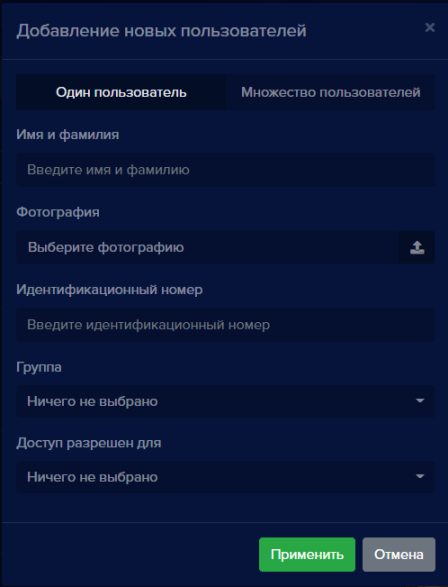

- Выберите вкладку **Один пользователь**,

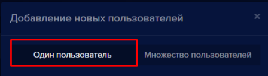

- Введите имя и фамилию человека, которого планируете добавить в поле **Имя и фамилия**, 

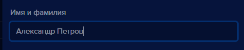

- Для того, чтобы добавить фото пользователя, кликните указателем мыши в поле **Фотография**,

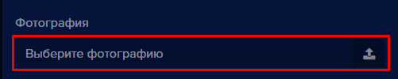

Откроется окно для выбора и загрузки фотографии

- Выберите фото на компьютере и загрузите его в **eVision**. Наименование выбранного фото появится в поле **Фотография**:

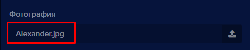

- В поле **Идентификационный номер** введите уникальный идентификатор сотрудника, эти данные нужны для отчета по пользователям

**!** Можно использовать любые уникальные, не повторяющиеся идентификаторы. Если у вас есть система учета сотрудников, то можно использовать эти идентификаторы

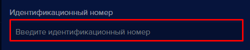

- В поле **Группа** выберите, принадлежность сотрудника к группе пользователей

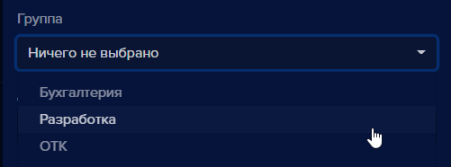

- В поле **Доступ разрешен для** выберите и отметьте устройство(ва), для которых данному пользователю необходимо разрешить доступ

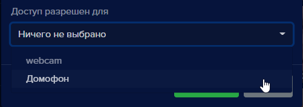

- Чтобы скрыть список с устройствами, необходимо кликнуть мышью в свободном месте 
- Нажмите кнопку **Применить** 

Окно добавления закроется и в списке пользователей появится новый сотрудник.

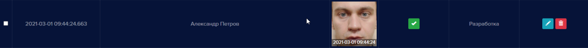

#### Добавление множества пользователей
Добавить несколько пользователей с фотографиями возможно если упаковать фотографии в один zip архив. Подготовьте фотографии сотрудников, в архиве одному сотруднику должно соответствовать одно фото. Фотографии не должны повторяться. Файлы в архиве должны называться согласно именам и фамилиям пользователей, т.к. при добавлении пользователей в **eVision** из архива имена сотрудникам будут даны соответственно названиям фотографий.

- Нажмите кнопку **Добавить нового пользователя** , откроется окно **Добавление новых пользователей**. Выберите переключатель **Множество пользователей.**

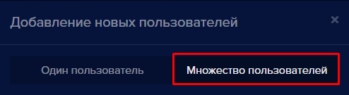

Кликните в поле **Выберите архив:**

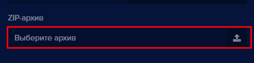

Откроется окно для открытия файлов.

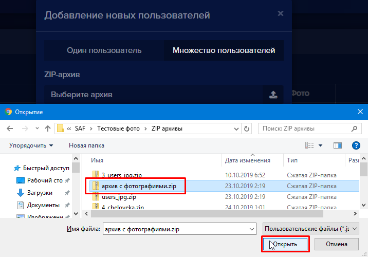 

Выберите zip-архив, нажмите кнопку **Открыть**. Имя zip-архива появится в строке ZIP-архив.

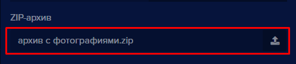

В окне добавления пользователей нажмите кнопку **Применить** 

После загрузки zip-архива в **eVision** появится уведомление:

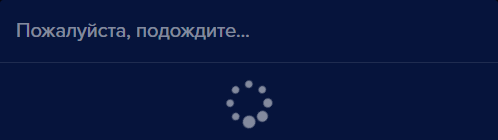

После ожидания появится уведомление с указанием количества успешно добавленных пользователей.

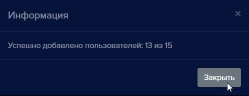

Нажмите кнопку **Закрыть**. 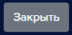

В списке пользователей будут отображены, добавленные из архива пользователи. Возможно качество фото не соответсвует требованиям освещения или разрешения, поэтому оно не будет добавлено. Необходимо заменить фото на более качественное.

#### Редактирование пользователя

Для того, чтобы изменить имя, фамилию, поменять или добавить фотографию, идентификатор пользователя или настроить доступ используйте редактирование пользователя:

- Нажмите кнопку **Редактировать** , откроется окно редактирования пользователя

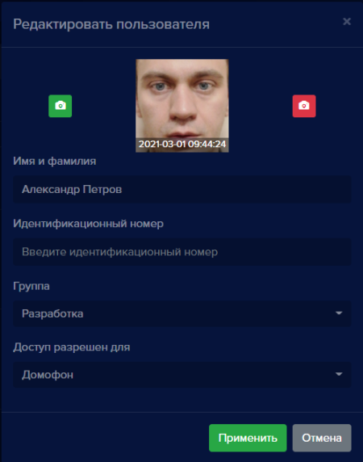

При необходимости: 
- измените имя и фамилию пользователя, 
- введите, измените или удалите идентификационный номер,
- выберите или отмените выбор группы,
- выберите или отмените выбор устройства для доступа пользователю.
- нажмите кнопку **Применить** 

Окно редактирования закроется, у выбранного пользователя будут отображены изменения. 
Включенный доступ на каком-либо устройстве будет отображаться так:, запрещенный доступ отображается так: .

#### Редактирование множества пользователей

В программе доступно редактирование множества пользователей. Для редактирования доступны следующие параметры:  

- Закрепить выбранных пользователей за определенной группой/группами
- Включить выбранным пользователям доступ на устройстве/устройствах
- Удалить выбранных пользователей

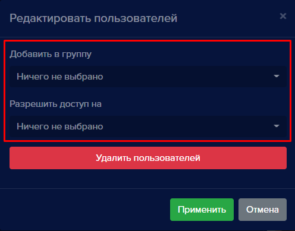

Для того что бы редактировать несколько пользователей необходимо проделать следующие шаги:

- В таблице отметьте галочками нужных вам пользователей

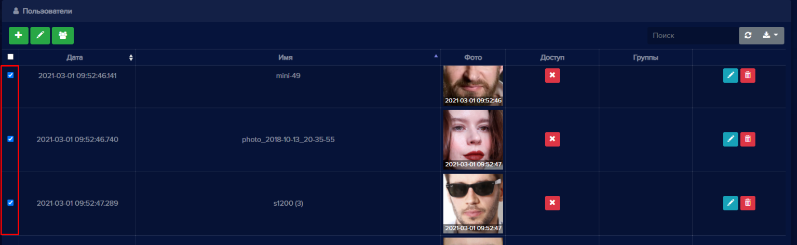

- Нажмите **Редактировать пользователей** 
- Появится окно редактирования, где вы можете назначить выбранным пользователям группу, а также разрешить доступ на одном или нескольких устройства, либо удалить выбранных пользователей
- После того как нужные операции выполнены нажмите **Применить**  для сохранения сделанных изменений.

#### Добавление фотографий пользователю

При необходимости каждому пользователю можно добавить несколько фотографий. Добавление дополнительных фото позволит увеличить точность распознавания.

Чтобы добавить фото:

- Выберите сотрудника, которому необходимо добавить фото:

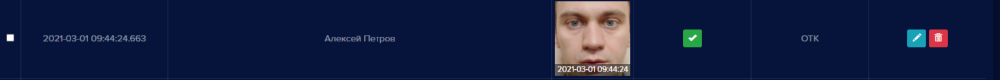

- Нажмите кнопку **Редактировать**. Откроется окно **Редактировать пользователя**

- Нажмите кнопку **Добавить фото**

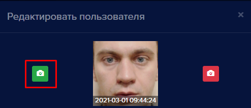 

Откроется окно для выбора и загрузки фотографии:

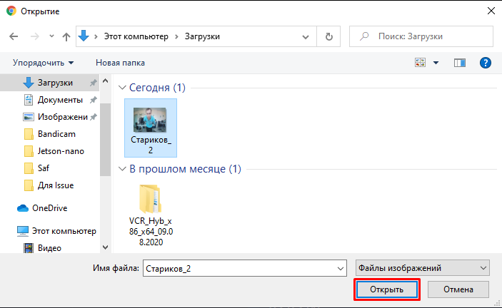

- Выберите фото на компьютере. 
- Нажмите кнопку **Открыть**, выбранное фото загрузится в **eVision** и появится в окне редактирования пользователя. 

- Чтобы просмотреть все фотографии пользователя, нажимайте на фото. При наведении курсора на фото, появится подсказка с количеством фотографий

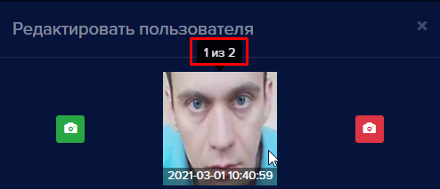.

#### Удаление фотографий пользователя

При необходимости удалите неподходящие фото пользователя. Удаляйте не качественные фотографии, смазанные и сделанные при недостаточном освещении. Чтобы удалить фото:

- Выберите пользователя, фото которого необходимо удалить:

- Нажмите кнопку **Редактировать** . Откроется окно **Редактировать пользователя**.

- В окне редактирования выберите фото, которое необходимо удалить, переключаясь между фотографиями нажимая на фото.

- Нажмите кнопку **Удалить фото**. 

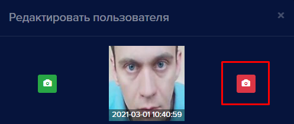 

Откроется окно с подтверждением:

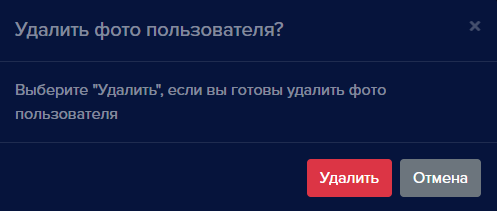

- Нажмите кнопку **Удалить** 
- Выбранное фото будет удалено.

#### Удаление пользователя
Для того, чтобы удалить пользователя:

- Выберите пользователя, которого необходимо удалить:

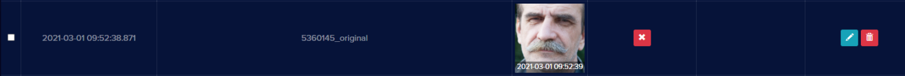

- Нажмите кнопку **Удалить пользователя** , откроется окно подтверждения удаления:

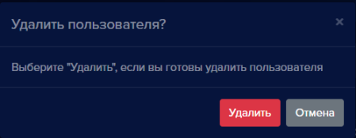

- Нажмите кнопку **Удалить** 

Окно подтверждения закроется, запись удалится из списка пользователей.

#### Добавление пользователей из Истории

В **eVision** существует возможность добавлять новых пользователей и фотографии созданным пользователям из **Истории** при распознавании. Для того что-бы добавить пользователей из **Истории**:

- Откройте вкладку **История** .png)

- Выберите из колонки **Фото** подходящее по качеству и освещению изображение человека,
- В строке с выбранным фото нажмите кнопку  **Добавить пользователя**, 

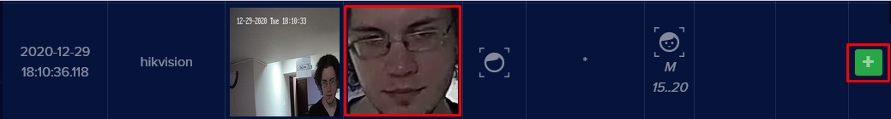

Откроется окно **Добавление нового пользователя**.

- В окне редактирования пользователя заполните необходимые поля Имя пользователя и доступ, при необходимости выберите Группу, а также введите идентификатор:

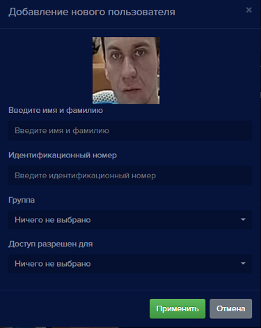

- Нажмите кнопку **Применить**,
- Проверьте на вкладке **Пользователи** созданную запись.

#### Добавление фотографии пользователю из Истории

В **eVision** можно добавить дополнительные фото созданным пользователям из **Истории**. Для этого необходимо точно указывать имя пользователя при выборе фото. Чтобы добавить фото из **Истории**:

- Откройте вкладку **История** 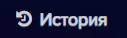,

- Выберите из колонки **Фото** изображение, которое было-бы лучше чем то, что уже есть у пользователя.

- В строке с выбранным фото нажмите кнопку  **Добавить пользователя**,

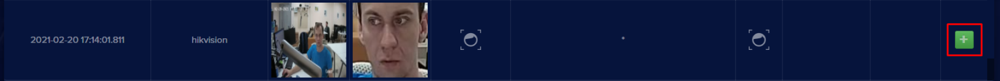

Откроется окно **Добавление нового пользователя**

- В поле **Введите имя и фамилию** введите точное имя пользователя, которому необходимо добавить выбранное фото. Будьте внимательны, указывайте имя так, как указано в базе пользователей.

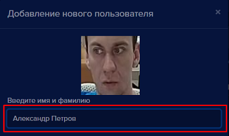

- Нажмите кнопку **Применить** . 
Появится уведомление:

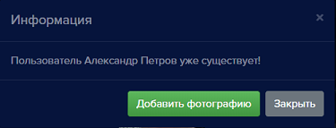

- Нажмите кнопку **Добавить фотографию** . Окно редактирования закроется.
- Проверьте добавленное фото пользователя на вкладке **Пользователи**.

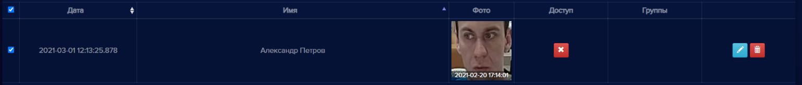

Теперь при наведении курсора на фото появляется всплывающая подсказка с количеством фото у данного пользователя. При клике мышью на фото, можно посмотреть другие фотографии пользователя.