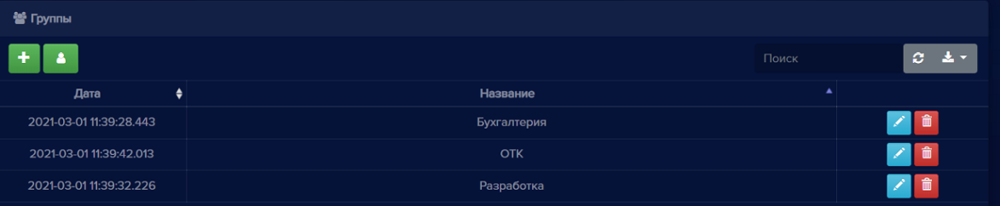
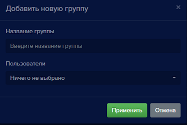
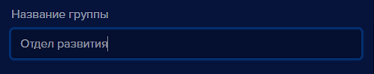
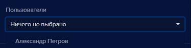
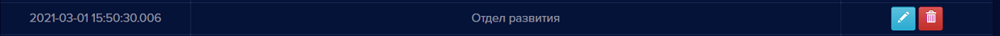
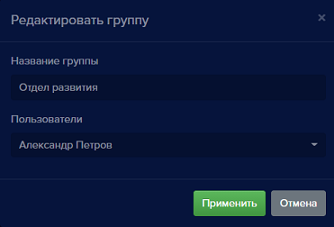
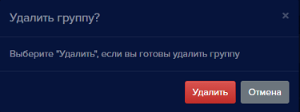

#### Группы
Данный раздел предназначен для создания и редактирования групп, в которые можно объединять пользователей. 

Для того, чтобы попасть на вкладку создания и редактирования групп:

- Находясь на вкладке **Пользователи**, нажмите кнопку **Переключиться на группы** , она расположена в верхней части окна **Пользователи**.  

Вкладка **Пользователи** сменит свой вид на **Группы**:

Для **Групп** доступны следующие операции:
- Добавление группы,
- Редактирование названия группы,
- Удаление группы. При удалении группы пользователи не удаляются, а исключаются из группы,
- Поиск,
- Обновление списка групп,
- Экспорт таблицы групп в файлы разных форматов.

Данные в таблице можно сортировать по Дате и по Названию группы.

#### Добавление группы

Для того, чтобы добавить группу:

- Нажмите кнопку **Добавить новую группу** , откроется окно **Добавить новую группу**:

- Введите название группы. Например, названия групп могут быть по наименованиям отделов.

- В выпадающем списке **Пользователи** можно добавить участников в группу.

- Нажмите кнопку **Применить** 

Окно добавления закроется и в списке групп появится новая группа.

#### Редактирование группы
Для того, чтобы изменить название группы: 

- Нажмите кнопку **Редактировать** , откроется окно **Редактировать группу**:

- При необходимости измените название группы, и участников.
- Нажмите кнопку **Применить** 

Окно редактирования закроется и в списке будет отображено новое название группы.

#### Удаление группы
Для того, чтобы удалить группу: 

- Нажмите кнопку **Удалить группу** , откроется окно подтверждения удаления:

- Нажмите кнопку **Удалить**  

Окно подтверждения закроется, группа удалится из списка групп.

#### Переключиться в режим Пользователи

Для переключения обратно в режим пользователей нажмите кнопку **Переключиться на пользователей**: 
