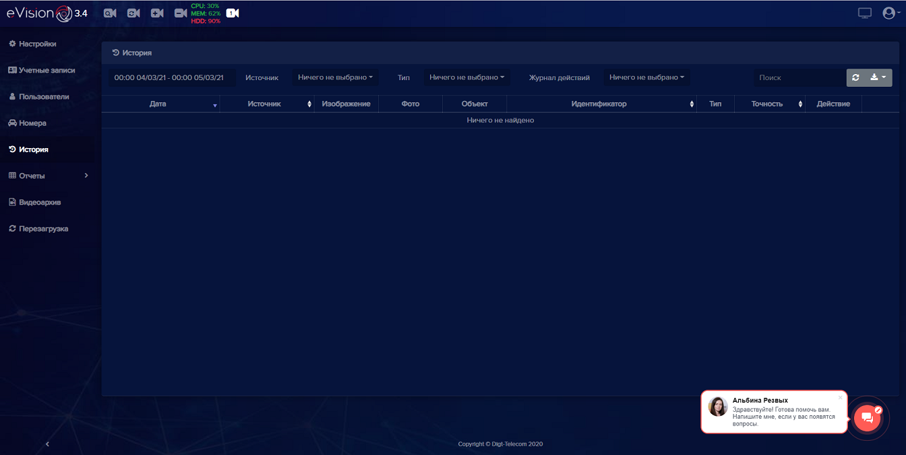

#### История
Вкладка **История** служит для хранения истории распознанных силуэтов, лиц автотранспорта и автомобильных номеров, также здесь отображаются события: **открытие замка**, **доступ запрещен**, **голосовое уведомление**.

 Область для выбора периода просмотра истории. При нажати на календарь появляется возможность выбора периода и времени отображения событий:

 Поле **Источник** позволяет выбирать события в истории по выбранному устройству.

 Поле **Тип** позволяет выбирать тип объектов для просмотра в истории. При выборе **Лицо** в истории отображается распознавание лиц. **Пользователей** - людей, при выборе **Автомобиль**, **Автомобильные номера** - в истории отображаются автомобили, и номера автомобилей. Если не выбран какой-либо тип, то в истории отображаются все распознанные объекты.

 Поле **Журнал действий** позволяет выбрать определенные действия, которые были связаны с замком и уведомлениями. Доступны варианты: **Открытие замка**, **Доступ запрещен** и **Голосовые уведомления**.

Пример данных:

 - Распознано лицо человека (включена **Видеоаналитика** и активирован режим **Распознавания лиц**).

 - Распознано лицо человека, которого нет в базе пользователей

 - Распознано лицо человека, который есть в базе пользователей

 - Распознан силуэт человека. 

 - Распознан силуэт автомобиля

 - Распознан Автомобильный номер, которого нет в базе автомобильных номеров.

 - Распознан Автомобильный номер, который есть в базе номеров. 

 - Доступ запрещен. Данному пользователю или автомобильному номеру запрещен доступ на устройстве

 - Точность с которой распознанное лицо совпадает с лицом пользователя

 - Распознано лицо человека, который есть в базе пользователей, данному сотруднику доступ на устройстве разрешен

 - Голосовое уведомление по SIP протоколу

Данные в **Истории** можно сортировать по дате, источнику, идентификатору и по точности. А также, в **Истории** доступны операции: поиск, обновление данных, экспорт событий истории в файлы различных форматов.

Если алгоритм распознавания не может установить сходство с имеющимися объектами в базе то в поле **Идентификатор**  появится знак * (“Звездочка”), за сравнение отвечает параметр **Порог распознавания**.