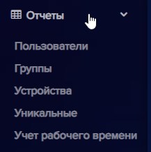
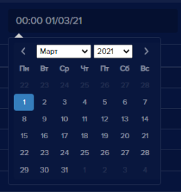
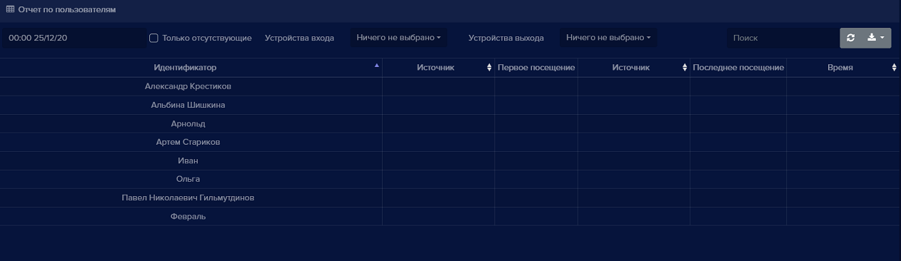
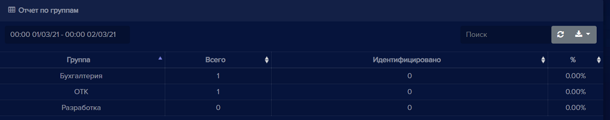
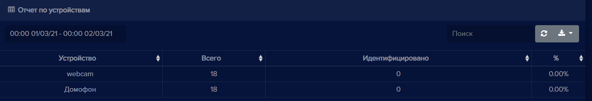
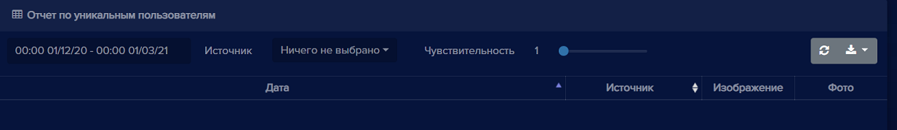
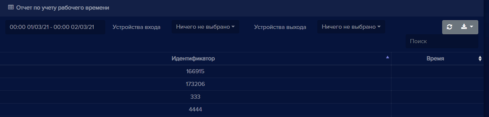

На вкладке **Отчеты** находятся пункты: **Пользователи, Группы, Устройства, Уникальные**, **Учет рабочего времени**. В каждом отчете есть календарь, в котором можно выбрать диапазон дат и время для отображения информации.

Область для выбора дат и времени. При нажатии на календарь появляется возможность выбора даты и времени отображения событий:

В каждом отчете доступны операции: поиск, обновление данных, экспорт событий истории в файлы различных форматов. 

#### Отчет по пользователям

В данном отчете отображается информация по посещениям пользователей.

**Только отсутствующие** - данная опция включает отображение в отчете пользователей, которые не распознаны, в выбранном временном промежутке.

 Поля **Устройства входа**  и **Устройства выхода**  предоставляют выбор устройств для формирования отчета распознавания пользователей.

#### Отчет по группам

В данном отчете отображается информация по распознаванию пользователей по группам, в которые включены. Отображается количество распознанных пользователей в каждой группе.

#### Отчет по устройствам

В данном отчете отображается количество распознанных персон по каждому устройству.

#### Отчет по уникальным пользователям

В данном отчете отображается количество уникальных распознанных пользователей.

Поле **Источник**  позволяет отобразить в отчете уникальных пользователей с выбранного устройства

Пункт **Чувствительность**  позволяет увеличить или уменьшить точность с которой отображаются распознанные пользователи.

#### Отчет Учет рабочего времени

В данном отчете формируются сводные данные о суммарном времени работы по пользователю за определенный период.