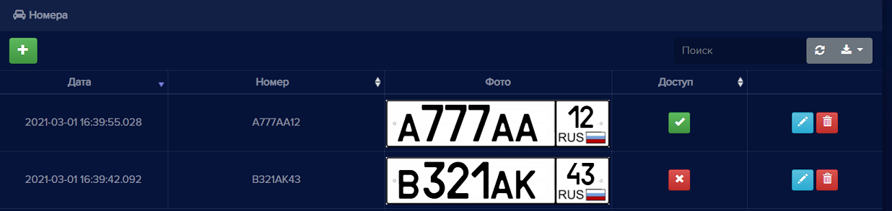
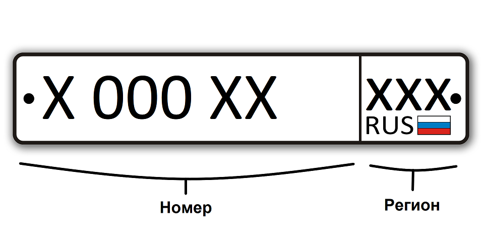
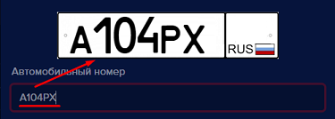
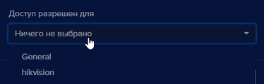
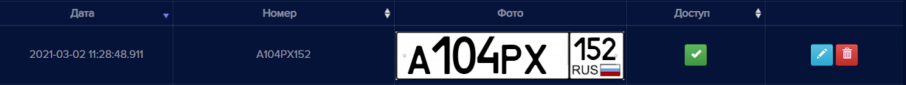
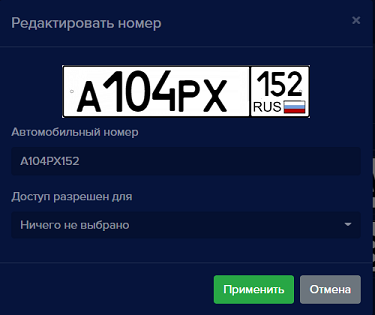

#### Номера
На вкладке **Номера** создается база данных автомобильных номеров для распознавания. Для каждого номера настраивается доступ на устройства, добавленные в **eVision**, тем самым разрешается  или запрещается автомобилю проезд на территорию. 

Поддерживаются только российские автомобильные однорядные номера:

Номер допускается указывать тремя буквами А,В,Е,К,М,Н,О,Р,С,Т,У,Х и тремя цифрами. Регион допускается указывать двумя или тремя цифрами.
Для автомобильных номеров доступны следующие операции:

- Добавление номера.
- Редактирование номера и доступа через устройства.
- Удаление номера. 
- Поиск.
- Обновление списка номеров.
- Экспорт таблицы номеров в файлы разных форматов.

В поле Доступ в списке номеров значок  означает, что у автомобильного номера есть доступ на территорию через устройства, значок   - доступа нет.

Данные в таблице номеров можно сортировать по Дате, по Номеру и по Доступу.

#### Добавление номера

Для того, чтобы добавить номер:

- Нажмите кнопку **Добавить новый номер** , откроется окно **Добавление нового номера**:

- Введите серию, номер и код региона автомобильного номера в соответствующее поле. При этом верхний графический элемент заполняется автоматически.

**!** Обратите внимание, что в поле Автомобильный номер серию номера можно вводить русскими и английскими буквами. Однако при вводе русских букв, они автоматически будут преобразованы в заглавные английские. Внешне буквы будут выглядеть одинаково, но записан номер будет в англоязычном формате. Данная транслитерация необходима для хранения номеров в едином формате. Поле Автомобильные номера непринимает русские буквы Б,Г,Д,Ё,Ж,З,И,Л,П,Ф,Ц,Ч,Ш,Щ,Й,Ь,Ъ,Э,Ю,Я.

Транслитерация русских букв в английские:

|Русская буква||Английская буква||
|-|-|-|-|
|Печатная буква|Произношение|Печатная буква|Произношение|
|А,а|[а]|A,a|[эй]|
|В,в |[вэ]|B,b|[би]|
|С,с|[эс]|C,c|[си]|
|Е,е|[е]|E,e|[и]|
|Н,н|[эн]|H,h|[эйч]|
|К,к|[ка]|K,k|[кей]|
|М,м|[эм]|M,m|[эм]|
|О,о|[о]|O,o|[оу]|
|Р,р|[эр]|P,p|[пи]|
|Т,т|[т]|T,t|[ти]|
|Х,х|[ха]|X,x|[экс]|
|У,у|[у]|Y,y|[уай]|

- Выберите устройство или несколько устройств, через которые транспортному средству разрешен въезд. Если устройство не выбрано, то доступ будет закрыт. Поле **Доступ разрешен для** можно заполнить позднее при операции редактирования.

- Нажмите кнопку **Применить** 

Окно добавления номера закроется и в списке номеров появится новый автомобильный номер.

#### Редактирование номера

Для того, чтобы изменить данные автомобильного номера или доступ через устройства: 

- Нажмите кнопку **Редактировать** , откроется окно **Редактировать номер**:

- При необходимости, измените номер или выберите устройства для доступа

- Нажмите кнопку **Применить** 

Окно редактирования закроется и в списке номеров отобразятся сделанные изменения.

#### Удаление номера

Для того, чтобы удалить номер: 

- Нажмите кнопку **Удалить номер** , откроется окно подтверждения удаления:

- Нажмите кнопку **Удалить** 

Окно подтверждения закроется, номер удалится из списка номеров.