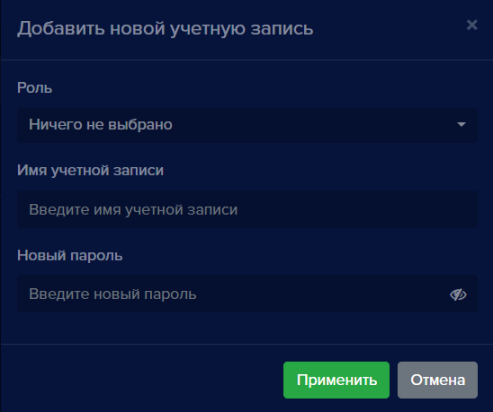
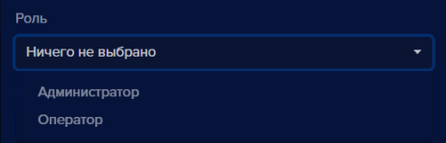
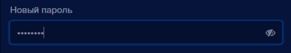
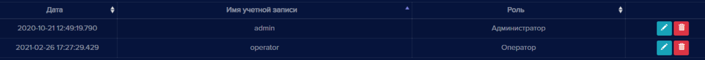
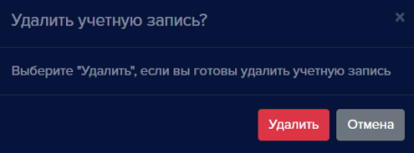

#### Учетные записи
Данный раздел предназначен для создания и редактирования учетных записей пользователей **eVision**. Для учетной записи указывается его роль (администратор или оператор):

**Администратор** обладает полным функционалом, включая просмотр видеопотока с устройств, создание и удаление устройств, пользователей, номеров, учетных записей и изменение общих настроек **eVision**.

**Оператор** может только просматривать видеопоток, список пользователей, номеров, групп. По умолчанию создана учетная запись с ролью Администратор - **admin**. 

Для учетных записей доступны следующие операции:

- Добавление и выбор роли пользователя.
- Редактирование роли пользователя.
- Удаление пользователя. 
- Поиск.
- Обновление списка пользователей.
- Экспорт таблицы пользователей в файлы разных форматов.

Права пользователей:

|Действия|Администратор|Пользователь|
| :- | :- | :- |
|Просмотр видеопотока|Да|Да|
|Просмотр видеоархива|Да|Да |
|Просмотр пользователей|Да|Да|
|Просмотр номеров|Да|Да|
|Просмотр групп|Да|Да|
|Просмотр истории|Да|Да|
|Просмотр отчетов|Да|Да|
|Работа с виджетом открытых линий|Да|Да|
|Добавление и удаление устройств|Да|Нет|
|Добавление и удаление пользователей |Да|Нет|
|Добавление и удаление номеров|Да|Нет|
|Добавление и удаление групп|Да|Нет|
|Добавление и удаление учетных записей|Да|Нет|
|Изменение общих настроек **eVision**|Да|Нет|

#### Добавление учетной записи
Для того, чтобы добавить учетную запись: 

- Нажмите кнопку **Добавить новую учетную запись** , откроется окно **Добавить новую учетную запись**:

- Выберите **Роль (Администратор** или **Оператор)**

- Введите **Имя учетной записи**

- Введите **Пароль учетной записи**

Если необходимо проверить введенный пароль:

- Нажмите кнопку для его отображения 
- Нажмите кнопку **Применить** 

Окно **Добавить новую учетную запись** закроется** и в списке появится новая учетная запись.

#### Редактирование учетной записи
Для того, чтобы изменить роль пользователя, имя или пароль:

- Нажмите кнопку **Редактировать** , откроется окно **Редактировать учетную запись**:

- При необходимости, измените роль, имя учетной записи или пароль

- Нажмите кнопку **Применить** 

Окно редактирования закроется и в списке записей отобразятся сделанные изменения.

#### Удаление учетной записи
Для того, чтобы удалить пользователя: 

- Нажмите кнопку **Удалить учетную запись** , откроется окно подтверждения удаления:

- Нажмите кнопку **Удалить**  

Окно подтверждения закроется, учетная запись удаляется из списка номеров.

**!** Обратите внимание, что если остается последний пользователь с ролью Администратор, удалить его невозможно.