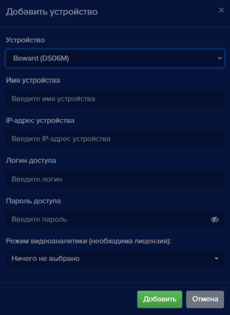

Для того, чтобы добавить новое видеоустройство, нажмите кнопку **Добавить устройство**  на **Панели устройств**. Откроется окно **Добавить устройство**, с выпадающим списком **Устройство**.

Для устройств в данном списке в **eVision** имеются предустановленные параметры для получения видеопотока и работы замка, которые не придется настраивать вручную.

*Для примера будет использован видеодомофон Beward DS06M.* 

- Выберите в списке **Устройство** пункт **Beward (DS06M)**, откроется окно параметров устройства.
- В поле **Имя устройства** введите наименование нового устройства, для ввода допускаются буквы и цифры. Укажите уникальное имя, означающее назначение или местоположение устройства, например *Вход, Домофон, Камера на въезде,*
- В поле **IP-адрес устройства** введите корректный IP адрес видеоустройства,
- В поле **Логин доступа** введите логин для доступа на устройство,
- В поле **Пароль доступа** введите пароль для доступа на устройство,
- В поле **Режим видеоаналитики (необходима лицензия)** выберите **Лицо**, если видеоустройство будет использоваться для распознавания лиц людей или **Автомобильные номера**, если видеоустройство предназначено для распознавания автомобильных номеров,
- Нажмите кнопку **Добавить**, откроется окно, в котором транслируется видео с данного устройства. 
При подключении видеодомофонов появляется  кнопка **Открыть замок** , при нажатии на нее срабатывает контроллер замка. Данная кнопка применяется для открытия двери вручную.

**!** Если в данном списке нет устройства, которое используется у вас, то в списке **Устройство** выберите пункт “Многоточие”. 