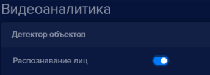
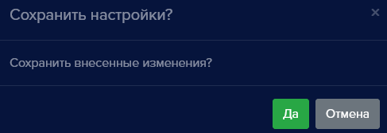
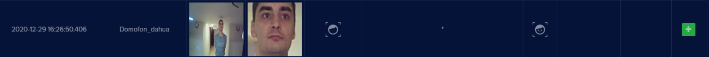
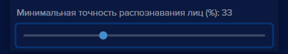
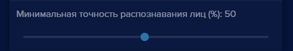

### Как включить авто добавление пользователей?
В **eVision** существует возможность собрать базу пользователей автоматически. Это можно применять в начале использования **eVision**, если еще нет качественных фотографий пользователей. 

Авто добавление пользователей позволяет добавляться их при распознавании лиц. После того, как все необходимые пользователи добавлены, автодобавление необходимо отключить. Добавленных пользователей необходимо отредактировать, ввести имена и фамилии, при необходимости выбрать группу, указать идентификатор и включить или выключить доступ на устройство. 

Для того, чтобы автодобавление работало, необходимо:

Добавить устройство (см. пункт [Добавление устройства](#_b6jhxxtq5fpf))
Ввести лицензионный ключ или использовать встроенную лицензию (см. пункт [Как активировать лицензию](#_sp1jtzprlj88))
Включить видеоаналитику (см. пункт [Как активировать лицензию и включить видеоаналитику](#_sp1jtzprlj88))

#### Включение автодобавления пользователей

Для того, чтобы включить авто добавление пользователей:

- Выберите устройство, нажмите на его номер на панели устройств , откроется видеопоток выбранного устройства
- Откройте **Настройки** , найдите блок **Видеоаналитика**:
- Проверьте, что переключатель **Распознавание лиц**  включено.

- Найдите пункт **Автодобавление не распознанных лиц**

- Нажмите на переключатель **Автодобавление не распознанных лиц**.

- Нажмите кнопку **Сохранить** 
- Нажмите кнопку **ОК**, появится уведомление:

- Нажмите кнопку **Да**.

Окно подтверждения настроек закроется.

- После распознавания лиц в базе пользователей появятся новые записи:

- Далее необходимо ввести имя пользователя, как отредактировать см. пункт [Редактирование пользователя](#_conv1l9o3mwg).

**!** Обратите внимание, что в зависимости от настроек распознавания см. пункт. [Настройки распознавания](#_ulhscr8sbkd0) будет добавлено разное количество пользователей. Чем выше порог распознавания, тем больше пользователей будет автоматически добавлено. Дело в том, что большое значение имеет направление взгляда человека и его эмоции в момент распознавания. Может получится так, что один и тот-же человек будет добавлен несколько раз. Повторяющихся пользователей с некачественными фотографиями нужно удалить и оставить только одного пользователя с правильным именем и настройками доступа.

Рекомендуем настройки точности распознавания оставить на уровне 30-40 %, в таком случае повторных авто добавленных персон будет меньше.

 

После того, как база персон, добавленных в **eVision** будет собрана, необходимо выключить Автодобавление. 

#### Выключение автодобавления пользователей

Для того, чтобы выключить автодобавление:

- Выберите устройство, нажмите на его номер на панели устройств , откроется видеопоток выбранного устройства
- Откройте **Настройки** , найдите блок **Видеоаналитика**:
- Включите пункт **Распознавание лиц** 
- Найдите пункт **Автодобавление не распознанных лиц**

- Нажмите на переключатель **Автодобавление не распознанных лиц**.

- Нажмите кнопку **Сохранить** , появится уведомление:

- Нажмите кнопку **Да**.

Окно подтверждения настроек закроется.

- Настройки распознавания приведите к значению по умолчанию - 50%

Автодобавление будет выключено и новые персоны добавляться не будут.
