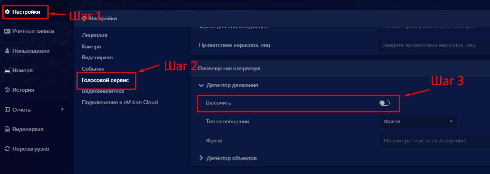

#### Как включить голосовые оповещения
В программе eVision вы можете включить голосовые оповещения для двух типов событий: при обнаружении в  кадре движения, и в случае обнаружения детекторами объектов (как распознанных так и не распознанных).

Для включения оповещений вам необходимо проделать следующие шаги:

- Перейти в **Настройки**,
- Выбрать подменю **Голосовой сервис**,
- В программе доступны два типа оповещения по движению: **Детектор движения** - доступен сразу при установке и **Детектор объектов**  - доступен при включенном модуле **Видеоаналитика**,
- Для включения любого из видов или совместно воспользуйтесь переключателем **Включить**. 