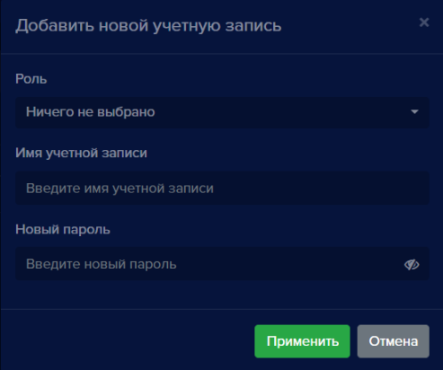

#### Добавление учетной записи
Для того, чтобы добавить учетную запись: 

- Нажмите кнопку **Добавить новую учетную запись** , откроется окно **Добавить новую учетную запись**:

- Выберите **Роль (Администратор** или **Оператор)**

- Введите **Имя учетной записи**

- Введите **Пароль учетной записи**

Если необходимо проверить введенный пароль:

- Нажмите кнопку для его отображения 
- Нажмите кнопку **Применить** 

Окно **Добавить новую учетную запись** закроется** и в списке появится новая учетная запись.

#### Редактирование учетной записи
Для того, чтобы изменить роль пользователя, имя или пароль:

- Нажмите кнопку **Редактировать** , откроется окно **Редактировать учетную запись**:

- При необходимости, измените роль, имя учетной записи или пароль

- Нажмите кнопку **Применить** 

Окно редактирования закроется и в списке записей отобразятся сделанные изменения.

#### Удаление учетной записи
Для того, чтобы удалить пользователя: 

- Нажмите кнопку **Удалить учетную запись** , откроется окно подтверждения удаления:

- Нажмите кнопку **Удалить**  

Окно подтверждения закроется, учетная запись удаляется из списка номеров.

**!** Обратите внимание, что если остается последний пользователь с ролью Администратор, удалить его невозможно.