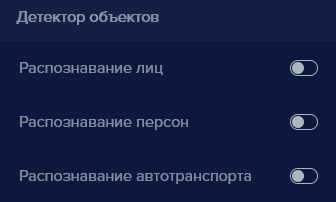
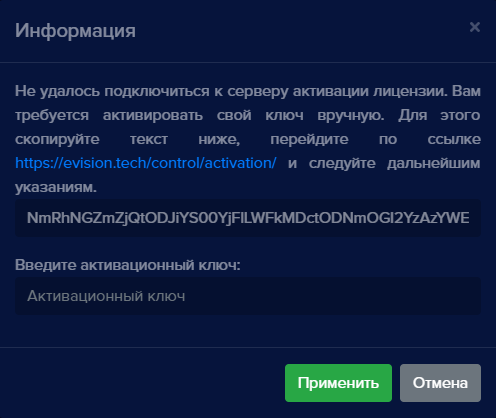
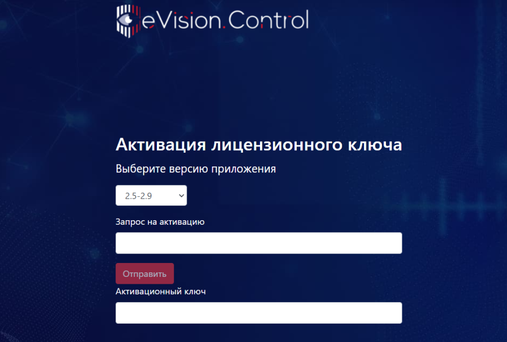
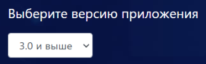
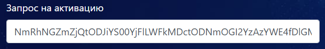
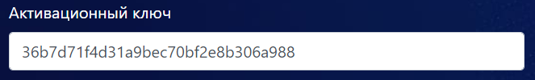
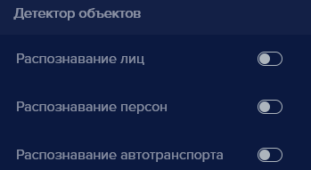
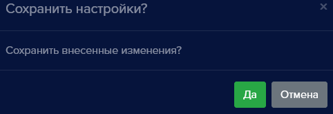

#### Как активировать лицензию без доступа в интернет?
В случае, если на компьютере, где установлен **eVision** отсутствует доступ в интернет, существует возможность активации лицензионного ключа в режиме оффлайн. Чтобы активировать лицензионный ключ без доступа в интернет:

- Добавьте устройство в **eVision**.
- Выберите устройство, нажмите на его номер на панели устройств , откроется видеопоток выбранного устройства
- Откройте вкладку **Настройки** , найдите блок настроек **Лицензия**
- Введите лицензионный ключ в поле **Лицензионный ключ**.

- Нажмите кнопку **Сохранить** , появится уведомление:
- 
- Нажмите кнопку **Да**.

Окно подтверждения настроек закроется.

- Откройте **Настройки** , найдите пункт **Видеоаналитика**:

- Нажмите на переключатель одни или несколько переключателей **Распознавание лиц, Распознавание персон, Распознавание автотранспорта**.

- Нажмите кнопку **Сохранить** , появится окно **Информация**.

Будет указан адрес сайта для активации лицензионного ключа. А также код активации, который нужно скопировать. Не закрывайте окно **Информация**.

- Перейдите по ссылке на компьютере с доступом в интернет: <https://evision.tech/control/activation/>, откроется страница **Активация Лицензионного ключа**:

- В поле **Выберите версию приложения** выберите пункт **3.0 и выше**:** 

- В поле **Запрос на активацию** вставьте текст из окна **Информация**:

Кнопка **Отправить** будет подсвечена красным.

- Нажмите кнопку **Отправить** 

В поле **Активационный ключ** появится активационный ключ:

- Скопируйте активационный ключ, перенесите его в **eVision**, и в окне **Информация** введите ключ в поле: **Введите активационный ключ**:

- Нажмите кнопку **Применить** , окно 
- **Информация** закроется.
- Откройте вкладку **Настройки**, найдите раздел **Видеоаналитика**:

- Нажмите на переключатель **Распознавание лиц, Распознавание персон, Распознавание автотранспорта**.

- Нажмите кнопку **Сохранить** , появится уведомление:

- Нажмите кнопку **Да**.

Окно подтверждения настроек закроется..
