#### Пример конфигурации с видеодомофоном:

1.Сервер с установленным **eVision**

2.Видеодомофон (с релейным выходом)

3.Замок (электромагнитный замок на двери или турникет)

4.Сетевой коммутатор

Если выход из помещения будет осуществляться без участия распознавания лиц, то понадобится кнопка открытия двери и контроллер для работы с замком.

#### Пример конфигурации с видеодомофоном и кнопкой открытия двери:

1.Сервер с установленным **eVision**

2.Видеодомофон (с релейным выходом)

3.Замок (электромагнитный замок на двери или турникет)

4.Сетевой коммутатор

5.Кнопка открытия двери

6.Контроллер замка (Пример:[Z5R](https://www.ironlogic.ru/il.nsf/htm/z5r))

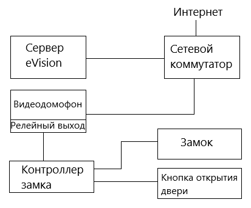

#### Пример конфигурации с видеокамерой:

1.Сервер с установленным **eVision**

2.Видеокамера

3.Сетевое реле (пример: [RODOS](https://silines.ru/ethernet/internet-relay/))

4.Замок (Электромагнитный замок на двери или турникет)

5.Сетевой коммутатор

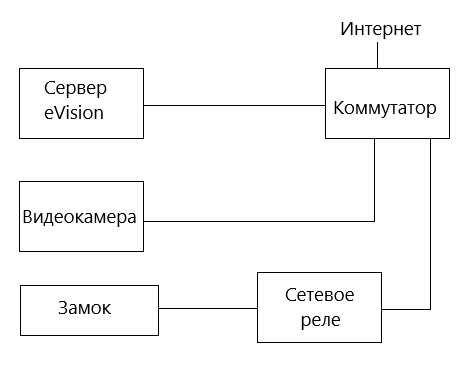

#### Особенности видеодомофонов
В **eVision** доступно использование видеодомофонов и домофонных панелей различных производителей. Протестированы модели: Beward DS06M (Beward DS06A(P)), Beward DKS15120, Beward DKS15122, Dahua VTO2101E-P, True IP - TI-3611CRW.

Ниже приведена сравнительная таблица характеристик и возможностей протестированных видеодомофонов:

|Домофон|Релейный выход|Получение вызова по SIP |Звук открытия замка|Разрешение камеры|Угол обзора|Встроенный считыватель карт|Кнопка вызова|
| :- | :- | :- | :- | :- | :- | :- | :- |
|Beward ds06m|Да|Да|Да|1280\*960|80º|Нет|Да|
|Beward DKS15120|Да|Да|Да|1280\*960|137º|Да|Да|
|Beward DKS15122|Да|Да|Да|1280\*960|137º|Да|Да|
|Dahua VTO2101E-P|Да|Нет|Нет|1080\*720|105º|Нет|Да|
|True IP - TI-3611CRW|Да|Нет|Нет|1080\*720|125º|Да|Нет|

#### Как подключить замок?

В программе **eVision** вы можете добавить исполнительное устройство для осуществления контроля и привязать его к существующей камере для этого:
- Выберите из камеру для которой необходимо добавить устройство контроля.

- Перейдите в **Настройки, События, Управление событиями, Управление замком**.

- Выберите тип устройства из списка

- Введите сетевой адрес, логин и пароль, укажите время открытия замка.

- Сохраните настройки.

#### Как подключить вебкамеру?

В **eVision** для Windows доступно использование одной веб-камеры. Для того, чтобы использовать веб камеру:

- Подключите веб-камеру к компьютеру, с установленным **eVision**. При необходимости установите драйвера для веб-камеры.
- Откройте **eVision**, нажмите кнопку **Добавить устройство** 
.

- В списке **Устройство** выберите пункт **Веб-камера**.

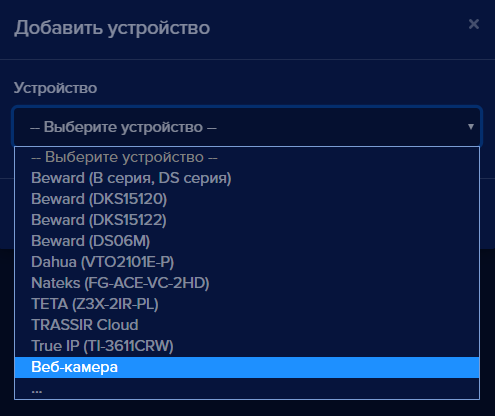

- В появившемся поле **Имя устройства** введите наименование для устройства.

- Нажмите кнопку **Добавить**

Откроется трансляция с веб-камеры:

#### Как деактивировать устройство?

Чтобы временно отключить (деактивировать) устройство в **eVision**:

- Добавьте устройство в **eVision**.
- Нажмите на номер устройства на панели устройств 
- Откройте **Настройки** , найдите раздел **Камера** , нажмите переключатель **Активация** 
- Нажмите кнопку **Сохранить** , появится уведомление:

- Нажмите кнопку **Да**. В окне трансляции видеопотока устройства появится сообщение: 

**!** Видеоаналитика будет недоступна, на этом устройстве.

#### Как переименовать устройство?

Название устройству задается при его добавлении. Добавление устройства описано в пункте [Добавление устройства](#_b6jhxxtq5fpf). Для изменения названия устройства:

- Откройте **Настройки** , найдите раздел **Камера** .
- В поле **Название** введите новое название устройства:

- Нажмите кнопку **Сохранить** , появится уведомление:

- Нажмите кнопку **Да**.
- Откройте **Настройки** , найдите раздел **Камера** .
- В поле **Название** будет указано новое название устройства.

#### Как работает встроенная лицензия на одно устройство?

Встроенная лицензия доступна в **eVision** на одно первое устройство. Встроенная лицензия активируется автоматически при добавлении первого устройства в **eVision**. Если удалить устройство со встроенной лицензией, то при добавлении следующего устройства встроенная лицензия автоматически применится на новое устройство.

|Операционная система|Срок действия встроенной лицензии на одно устройство|
| :- | :- |
|Windows|365 дней|
|Ubuntu|14 дней|

#### Как активировать лицензию и включить видеоаналитику?

Для того, чтобы активировать лицензию:

- Добавьте устройство в **eVision**.
- Нажмите на номер устройства на панели устройств , откроется видеопоток выбранного устройства
- Откройте вкладку **Настройки** , найдите блок настроек **Лицензия**
- Введите лицензионный ключ в поле **Лицензионный ключ**.

- Нажмите кнопку **Сохранить** , появится уведомление:

- Нажмите кнопку **Да**.
- Откройте **Настройки** , найдите пункт **Видеоаналитика**:

- Нажмите на один или несколько переключателей **Распознавание лиц, Распознавание персон, Распознавание автотранспорта**.

- Нажмите кнопку **Сохранить** , появится уведомление:

- Нажмите кнопку **Да**.

Окно подтверждения настроек закроется. В настройках устройства, в поле **Активационный ключ** автоматически появится комбинация активационного ключа:

**!** Комбинация активационного ключа генерируется через интернет. В случае отсутствия доступа в интернет на компьютере можно получить активационный ключ вручную, см пункт [Как активировать лицензию без доступа в интернет?](#_su5subj2y2a3)

- Проверьте распознавание объектов.

**!** Сохраните лицензионный и активационный ключи, в случае их удаления или удаления устройства, восстановить пару ключей невозможно. Активационный и лицензионный ключи можно использовать на данном компьютере для одного устройства.
#### Как активировать лицензию без доступа в интернет?
В случае, если на компьютере, где установлен **eVision** отсутствует доступ в интернет, существует возможность активации лицензионного ключа в режиме оффлайн. Чтобы активировать лицензионный ключ без доступа в интернет:

- Добавьте устройство в **eVision**.
- Выберите устройство, нажмите на его номер на панели устройств , откроется видеопоток выбранного устройства
- Откройте вкладку **Настройки** , найдите блок настроек **Лицензия**
- Введите лицензионный ключ в поле **Лицензионный ключ**.

- Нажмите кнопку **Сохранить** , появится уведомление:
- 
- Нажмите кнопку **Да**.

Окно подтверждения настроек закроется.

- Откройте **Настройки** , найдите пункт **Видеоаналитика**:

- Нажмите на переключатель одни или несколько переключателей **Распознавание лиц, Распознавание персон, Распознавание автотранспорта**.

- Нажмите кнопку **Сохранить** , появится окно **Информация**.

Будет указан адрес сайта для активации лицензионного ключа. А также код активации, который нужно скопировать. Не закрывайте окно **Информация**.

- Перейдите по ссылке на компьютере с доступом в интернет: <https://evision.tech/control/activation/>, откроется страница **Активация Лицензионного ключа**:

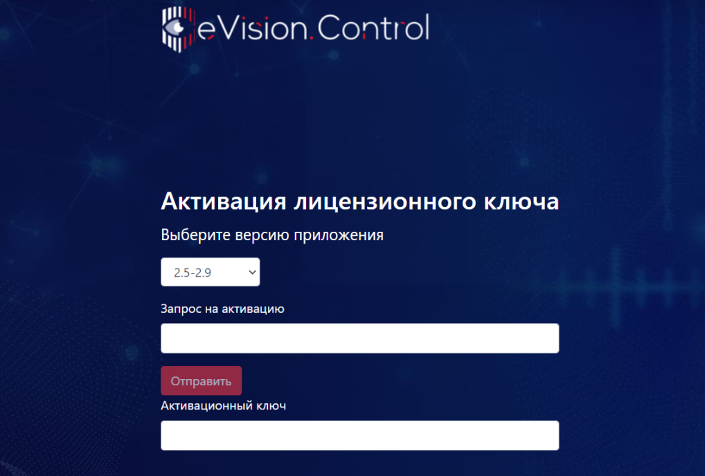

- В поле **Выберите версию приложения** выберите пункт **3.0 и выше**:** 

- В поле **Запрос на активацию** вставьте текст из окна **Информация**:

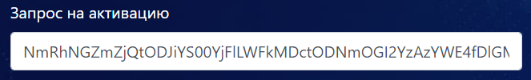

Кнопка **Отправить** будет подсвечена красным.

- Нажмите кнопку **Отправить** 

В поле **Активационный ключ** появится активационный ключ:

- Скопируйте активационный ключ, перенесите его в **eVision**, и в окне **Информация** введите ключ в поле: **Введите активационный ключ**:

- Нажмите кнопку **Применить** , окно 
- **Информация** закроется.
- Откройте вкладку **Настройки**, найдите раздел **Видеоаналитика**:

- Нажмите на переключатель **Распознавание лиц, Распознавание персон, Распознавание автотранспорта**.

- Нажмите кнопку **Сохранить** , появится уведомление:

- Нажмите кнопку **Да**.

Окно подтверждения настроек закроется..
#### Как перенести лицензию с одного устройства на другое?
Один лицензионный ключ может работать только на одном устройстве. При необходимости лицензию можно перенести на другое устройство.

- Откройте настройки устройства, на котором нужно использовать лицензионный ключ:

- Введите лицензионный и активационный ключ, с другого устройства.

- Нажмите кнопку **Сохранить** , появится уведомление:

- Нажмите кнопку **Да**.
- Откройте **Настройки** , найдите пункт **Видеоаналитика**:
- Нажмите на переключатель **Распознавание лиц, Распознавание персон, Распознавание автотранспорта**.

- Нажмите кнопку **Сохранить** , появится уведомление:

- Нажмите кнопку **Да**..

Окно подтверждения настроек закроется. Откроется информационное окно, с наименованием устройства, на котором в данный момент используется лицензионный ключ и включена видеоаналитика.

- Нажмите кнопку **ОК**.  

Окно подтверждения настроек закроется.

#### Как выбрать режим видеоаналитики?
Режим видеоаналитики выбирается при добавлении устройства и в настройках устройства.

- при добавлении устройства:

- в настройках этого устройства:

#### Как проверить видеоаналитику?
Когда добавлено устройство, введен лицензионный ключ и включена видеоаналитика, можно проверить распознавание объектов. По-умолчанию, при добавлении устройства выбирается режим **Лицо**.
#### Распознавание лиц
Когда человек появляется в зоне распознавания, на видеопотоке при распознавании появляется цветная рамка с именем или идентификатором пользователя:

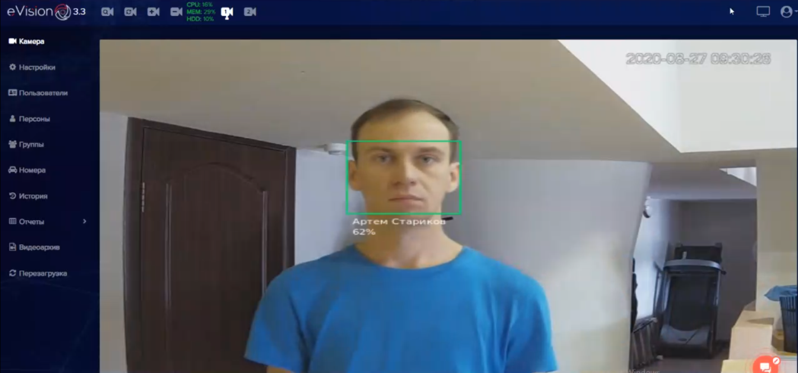
#### Распознавание автомобильных номеров
Когда автомобильный номер машины появляется в зоне распознавания, на видеопотоке при распознавании появляется цветная рамка с идентификатором номера:

#### Как включить авто добавление пользователей?
В **eVision** существует возможность собрать базу пользователей автоматически. Это можно применять в начале использования **eVision**, если еще нет качественных фотографий пользователей. 

Авто добавление пользователей позволяет добавляться их при распознавании лиц. После того, как все необходимые пользователи добавлены, автодобавление необходимо отключить. Добавленных пользователей необходимо отредактировать, ввести имена и фамилии, при необходимости выбрать группу, указать идентификатор и включить или выключить доступ на устройство. 

Для того, чтобы автодобавление работало, необходимо:

Добавить устройство (см. пункт [Добавление устройства](#_b6jhxxtq5fpf))
Ввести лицензионный ключ или использовать встроенную лицензию (см. пункт [Как активировать лицензию](#_sp1jtzprlj88))
Включить видеоаналитику (см. пункт [Как активировать лицензию и включить видеоаналитику](#_sp1jtzprlj88))
#### Включить авто добавление пользователей.

Для того, чтобы включить авто добавление пользователей:

- Выберите устройство, нажмите на его номер на панели устройств , откроется видеопоток выбранного устройства
- Откройте **Настройки** , найдите блок **Видеоаналитика**:
- Проверьте, что переключатель **Распознавание лиц**  включено.

- Найдите пункт **Автодобавление не распознанных лиц**

- Нажмите на переключатель **Автодобавление не распознанных лиц**.

- Нажмите кнопку **Сохранить** 
- Нажмите кнопку **ОК**, появится уведомление:

- Нажмите кнопку **Да**.

Окно подтверждения настроек закроется.

- После распознавания лиц в базе пользователей появятся новые записи:

- Далее необходимо ввести имя пользователя, как отредактировать см. пункт [Редактирование пользователя](#_conv1l9o3mwg).

**!** Обратите внимание, что в зависимости от настроек распознавания см. пункт. [Настройки распознавания](#_ulhscr8sbkd0) будет добавлено разное количество пользователей. Чем выше порог распознавания, тем больше пользователей будет автоматически добавлено. Дело в том, что большое значение имеет направление взгляда человека и его эмоции в момент распознавания. Может получится так, что один и тот-же человек будет добавлен несколько раз. Повторяющихся пользователей с некачественными фотографиями нужно удалить и оставить только одного пользователя с правильным именем и настройками доступа.

Рекомендуем настройки точности распознавания оставить на уровне 30-40 %, в таком случае повторных авто добавленных персон будет меньше.

 

После того, как база персон, добавленных в **eVision** будет собрана, необходимо выключить Автодобавление. Для того, чтобы выключить автодобавление:

- Выберите устройство, нажмите на его номер на панели устройств , откроется видеопоток выбранного устройства
- Откройте **Настройки** , найдите блок **Видеоаналитика**:
- Включите пункт **Распознавание лиц** 
- Найдите пункт **Автодобавление не распознанных лиц**

- Нажмите на переключатель **Автодобавление не распознанных лиц**.

- Нажмите кнопку **Сохранить** , появится уведомление:

- Нажмите кнопку **Да**.

Окно подтверждения настроек закроется.

- Настройки распознавания приведите к значению по умолчанию - 50%

Автодобавление будет выключено и новые персоны добавляться не будут.

#### Как включить синхронизацию для устройств Beward серии TFR
Для добавления устройства Beward TFR и синхронизации базы пользователей с **eVision** нажмите на кнопку добавления устройства , в настройках диалогового окна выберите пункт “Beward TFR”

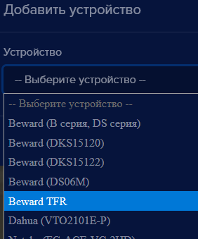

После добавления устройства станет доступной новая кнопка в интерфейсе раздела **Пользователи**.

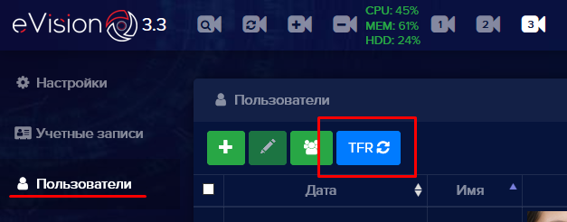

При нажатии на кнопку происходит синхронизация базы пользователей **eVision** с базой устройства Beward. По окончанию синхронизации появится сообщение “Синхронизировано устройств: 1” - синхронизация прошла успешно.

Во время синхронизации были добавлены все пользователи из списка **eVision** в базу устройства Beward. Чтобы посмотреть список добавленных пользователей перейдите в панель управления устройством (сетевой адрес указан в инструкции к устройству). 

Авторизуйтесь на устройстве, затем перейдите в **Настройки пользователей**.

В правой части интерфейса выберите период в котором была произведена синхронизация и нажмите **Поиск**. В таблице отобразятся добавленные пользователи.

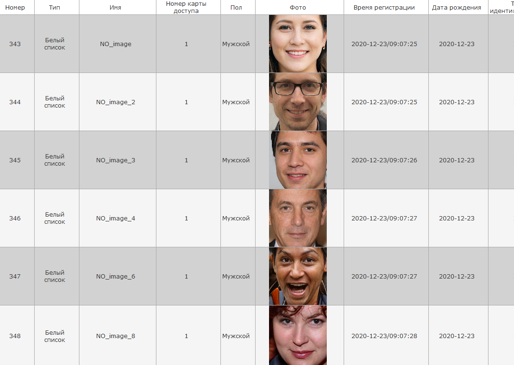

#### Как отключить устройство Beward TFR и уведомления.
Для удаления устройства из программы вам необходимо выбрать устройство в панели **Подключенных устройств** ,

нажмите на кнопку удаления устройства . Устройство удалено из системы но Beward TFR будет отсылать уведомления в систему для отключения этих уведомлений проделайте следующие шаги:

- Откройте в браузере адрес по которому у вас в сети находится видеокамера (адрес можно узнать из инструкции к устройству, или своего системного администратора),
- Перейдите в панель управления камерой и авторизуйтесь,
- в главном меню панели перейдите на вкладку **Системные настройки**

- в боковом меню выберите пункт **HTTP подписка**

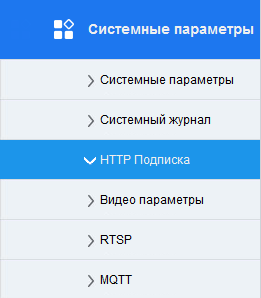

- Выберите пункты **Нет подписки** в полях **Подписка на обнаружение лиц, Подписка на незарегистрированные лица**.

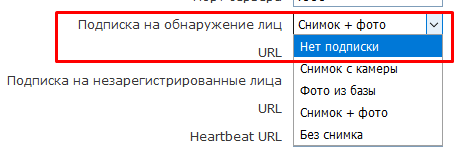

- Снимите галочку с поля **Push**

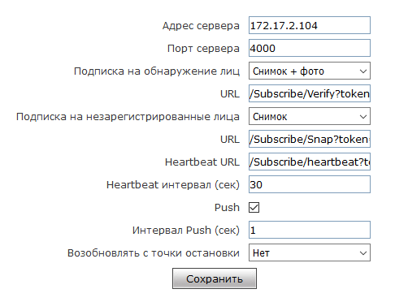

- После того как изменения сделаны нажмите кнопку **Сохранить**, теперь панель Beward TFR не будет посылать уведомления в программу **eVision**

#### Как сохранить лицензионный и активационный ключи устройства?

Для того чтобы сохранить **Лицензионный ключ** и **Активационный ключ** необходимо проделать следующие действия:

- В главном окне программы перейти в раздел **Настройки**
- В подменю выбрать раздел **Лицензия**
- Удалить текст из полей **Лицензионный ключ** и **Активационный ключ**
- Сохранить настройки
Появится окно **Сохранить настройки**, в котором необходимо нажать кнопку **Сохранить ключи**. Появится окно с запросом сохранения файла

После того как файл сохранен нажмите **Отмена**  для того чтобы не удалять ключи из программы.

#### Как скопировать лицензионный и активационный ключи устройства?

Для того что бы скопировать **Лицензионный ключ** и **Активационный ключ** необходимо проделать следующие действия:

- В главном окне программы перейти в раздел **Настройки**.
- В подменю выбрать раздел **Лицензия**
- Выделить текст из поля **Лицензионный ключ**, нажать правую кнопку мыши и выбрать пункт “Копировать” (либо на клавиатуре воспользоваться сочетанием клавиш **ctrl + c**). 
- Откройте место куда вы запишите скопированный ключ (приложение текстовый редактор).
- Поставьте курсор в место куда требуется вставить данные, нажмите правой кнопкой и в появившемся меню выберите пункт **Вставить** (либо на клавиатуре воспользуйтесь сочетанием клавиш **ctrl + v**). 
- Сохраните полученный результат.
Для того чтобы скопировать **Активационный ключ** проделайте шаги с третьего по шестой. 

#### Как включить голосовые оповещения
В программе eVision вы можете включить голосовые оповещения для двух типов событий: при обнаружении в  кадре движения, и в случае обнаружения детекторами объектов (как распознанных так и не распознанных).

Для включения оповещений вам необходимо проделать следующие шаги:

- Перейти в **Настройки**,
- Выбрать подменю **Голосовой сервис**,
- В программе доступны два типа оповещения по движению: **Детектор движения** - доступен сразу при установке и **Детектор объектов**  - доступен при включенном модуле **Видеоаналитика**,
- Для включения любого из видов или совместно воспользуйтесь переключателем **Включить**. О том как включить **Видеоаналитику**  можно узнать по этой [ссылке](#_n2vl2bdev4k2).

#### Как включить SIP уведомления?
Для использовани уведомления по SIP протоколу необходимо, чтобы устройство для распознавания поддерживало входящие вызовы по SIP без регистрации. Для примера будет использовано устройство Beward DS06A. Необходимо произвести предварительную настройку устройства Beward DS06A, для этого:

- Откройте в браузере интерфейс Beward DS06A. По умолчанию IP адрес Beward DS06A: *192.168.0.99*
- Перейдите в раздел **Сеть**, найдите пункт **SIP**
- Отметьте галочкой пункт **Разрешить SIP # 1**
- Пропишите в поля: **Имя, Номер, Имя пользователя** краткий идентификатор для sip вызова на устройство Beward DS06A.
- В поле **Пароль** введите пароль, он может не использоваться для работы sip уведомлений, но он необходимо для безопасности.
- В поле **SIP порт** можно прописать порт для приема SIP вызова из eVision, но этот параметр необязателен.
- Отметьте галочкой пункт **Принимать входящие вызовы**
- Нажмите кнопку **Сохранить**

Для включения SIP уведомлений в программе, вам необходимо:

Выберите устройство, нажмите на его номер на панели устройств 

Откроется видеопоток выбранного устройства

Откройте **Настройки** 
Найдите блок **Голосовой сервис**, найдите пункт **Настройка SIP уведомлений**
Переведите переключатель **Включить** в состояние включено 
Пропишите в строке **SIP URI** строку для обращения **eVision** к устройству Beward DS06A в формате: *sip:door@172.17.2.100:5063*. Где: door - номер устройства, который был введен в настройках устройства Beward DS06A, в пункте **SIP**; 172.17.2.100 - IP адрес устройства Beward DS06A; 5063 - порт для SIP вызова, необязательный параметр.

- Нажмите кнопку **Сохранить** , появится уведомление:

- Нажмите кнопку **Да**.

Окно подтверждения настроек закроется. Теперь SIP уведомления можно проверить. 

Следует помнить, что при использовании sip уведомлений, необходимо, чтобы был настроек замок. Настройка замка описана в пункте [25](#_xl0s61bc2vfd), данного руководства.

#### Как включить сервис eVision.Cloud?

Для того чтобы включить сервис **eVision Cloud** перейдите в **Настройки**,  далее в **Подключение к eVision Cloud** и затем нажмите **Активировать** 

Для того чтобы использовать **eVision Cloud**  необходимо зарегистрироваться в системе [TrustedID](https://trusted.plus/id/). После нажатия на **Зарегистрировать устройство**, откроется окно с авторизацией на портале.

#### Как поменять пароль Администратора?

**!** Для того чтобы сменить пароль администратора, необходимо находиться в системе под учетной записью роль Администратор.

Для смены пароля учетной записи администратора выполните следующие действия:

Перейдите во вкладку **Учетные записи**
Выберите учетную запись по роли в системе - **Администратор**

Нажмите редактировать и введите новый пароль учетной записи в поле **Новый пароль**

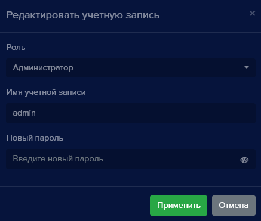

Нажмите **Применить**.

#### Какие права есть у пользователя группы Оператор?

Для учетных записей группы **Оператор** доступны следующие права:

- Просмотр видеопотока
- Просмотр видеоархива
- Просмотр персон
- Просмотр номеров
- Просмотр групп
- Просмотр истории
- Просмотр отчетов
- Работа с виджетом открытых линий

#### Как включить переадресацию портов?

Для включения переадресации портов в программе **eVision** перейдите в **Настройки** программы

Выберите пункт **Переадресация портов**, раскроется меню дополнительных настроек где можно включить переадресацию портов, и указать **Внешний порт**, **Внешний IP**
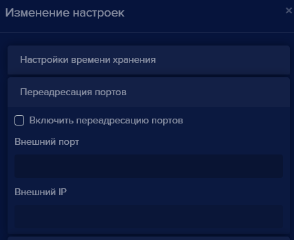

#### Как включить UPnP?

Для того что бы включить UPnP (Universal Plug and Play) перейдите в **Настройки** программы.

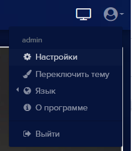

В окне **Изменение настроек** выберите пункт **UPnP**, откроется раскрывающееся меню где можно включить или отключить данную настройку.

#### Как работает точность распознавания?

Для того что бы настроить точность распознавания  перейдите в **Меню общих настроек** , **Настройки** , и далее выберите пункт **Настройки распознавания**.

Параметр **Минимальная точность распознавания лиц**  позволяет настроить порог при котором программа будет считать что распознанное лицо совпадает с имеющимися в базе пользователем.

#### Как работает экспорт и импорт?

В программе **eVision** доступны следующие виды экспорта/импорта:

- Настройки - общие настройки программы
- Устройства - добавленные в **eVision** устройства и их настройки.
- База данных учетных записей
- База данных пользователей
- База данных автомобильных номеров

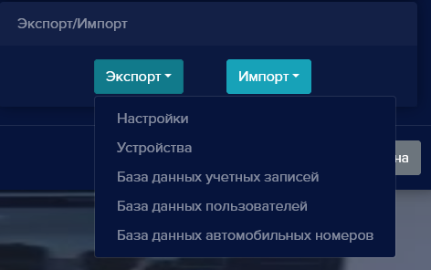

Экспорт и импорт настроек происходит в формате **JSON** и упаковывается при экспорте в формате **ZIP**.