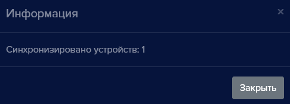
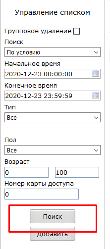
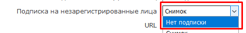

Для устройств Beward TFR предусмотрена возможность синхронизации базы данных пользователей и истории распознавания средствами видеоаналитики на самом устройстве Beward TFR. В этом случае распознавание будет происходить на устройстве Beward TFR, а история распознанных пользователей будет храниться в Beward TFF и в eVision. При этом управление исполнительным устройством будет происходить с устройства Beward TFR.

#### Как включить синхронизацию для устройств Beward серии TFR
Для добавления устройства Beward TFR и синхронизации базы пользователей с **eVision** нажмите на кнопку добавления устройства , в настройках диалогового окна выберите пункт “Beward TFR”

После добавления устройства станет доступной новая кнопка в интерфейсе раздела **Пользователи**.

При нажатии на кнопку происходит синхронизация базы пользователей **eVision** с базой устройства Beward. По окончанию синхронизации появится сообщение “Синхронизировано устройств: 1” - синхронизация прошла успешно.

Во время синхронизации были добавлены все пользователи из списка **eVision** в базу устройства Beward. Чтобы посмотреть список добавленных пользователей перейдите в панель управления устройством (сетевой адрес указан в инструкции к устройству). 

Авторизуйтесь на устройстве, затем перейдите в **Настройки пользователей**.

В правой части интерфейса выберите период в котором была произведена синхронизация и нажмите **Поиск**. В таблице отобразятся добавленные пользователи.

#### Как отключить устройство Beward TFR и уведомления
Для удаления устройства из программы вам необходимо выбрать устройство в панели **Подключенных устройств** ,

нажмите на кнопку удаления устройства . Устройство удалено из системы но Beward TFR будет отсылать уведомления в систему для отключения этих уведомлений проделайте следующие шаги:

- Откройте в браузере адрес по которому у вас в сети находится видеокамера (адрес можно узнать из инструкции к устройству, или своего системного администратора),
- Перейдите в панель управления камерой и авторизуйтесь,
- в главном меню панели перейдите на вкладку **Системные настройки**

- в боковом меню выберите пункт **HTTP подписка**

- Выберите пункты **Нет подписки** в полях **Подписка на обнаружение лиц, Подписка на незарегистрированные лица**.

- Снимите галочку с поля **Push**

- После того как изменения сделаны нажмите кнопку **Сохранить**, теперь панель Beward TFR не будет посылать уведомления в программу **eVision**

