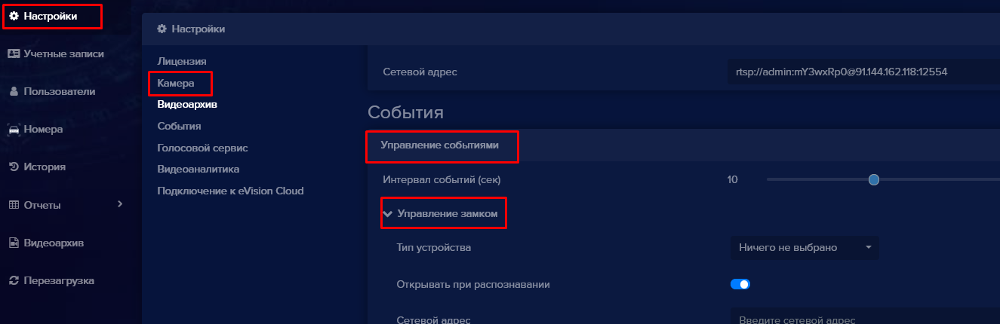

В программе **eVision** вы можете добавить исполнительное устройство для осуществления контроля и привязать его к существующей камере для этого:
- Выберите из камеру для которой необходимо добавить устройство контроля.

- Перейдите в **Настройки, События, Управление событиями, Управление замком**.

- Выберите тип устройства из списка

- Введите сетевой адрес, логин и пароль, укажите время открытия замка.

- Сохраните настройки.

Статья не дописана!
