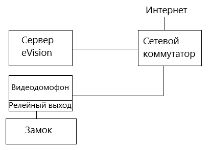

#### Пример конфигурации с видеодомофоном:

1.Сервер с установленным **eVision**

2.Видеодомофон (с релейным выходом)

3.Замок (электромагнитный замок на двери или турникет)

4.Сетевой коммутатор

Если выход из помещения будет осуществляться без участия распознавания лиц, то понадобится кнопка открытия двери и контроллер для работы с замком.

#### Пример конфигурации с видеодомофоном и кнопкой открытия двери:

1.Сервер с установленным **eVision**

2.Видеодомофон (с релейным выходом)

3.Замок (электромагнитный замок на двери или турникет)

4.Сетевой коммутатор

5.Кнопка открытия двери

6.Контроллер замка (Пример:[Z5R](https://www.ironlogic.ru/il.nsf/htm/z5r))

#### Пример конфигурации с видеокамерой:

1.Сервер с установленным **eVision**

2.Видеокамера

3.Сетевое реле (пример: [RODOS](https://silines.ru/ethernet/internet-relay/))

4.Замок (Электромагнитный замок на двери или турникет)

5.Сетевой коммутатор

#### Особенности видеодомофонов
В **eVision** доступно использование видеодомофонов и домофонных панелей различных производителей. Протестированы модели: Beward DS06M (Beward DS06A(P)), Beward DKS15120, Beward DKS15122, Dahua VTO2101E-P, True IP - TI-3611CRW.

Ниже приведена сравнительная таблица характеристик и возможностей протестированных видеодомофонов:

|Домофон|Релейный выход|Получение вызова по SIP |Звук открытия замка|Разрешение камеры|Угол обзора|Встроенный считыватель карт|Кнопка вызова|
| :- | :- | :- | :- | :- | :- | :- | :- |
|Beward ds06m|Да|Да|Да|1280\*960|80º|Нет|Да|
|Beward DKS15120|Да|Да|Да|1280\*960|137º|Да|Да|
|Beward DKS15122|Да|Да|Да|1280\*960|137º|Да|Да|
|Dahua VTO2101E-P|Да|Нет|Нет|1080\*720|105º|Нет|Да|
|True IP - TI-3611CRW|Да|Нет|Нет|1080\*720|125º|Да|Нет|
