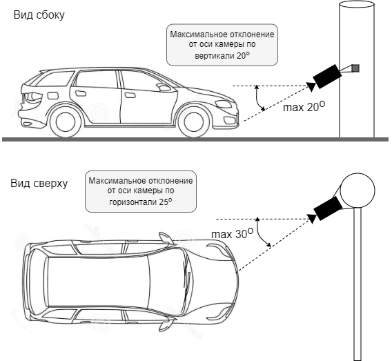

#### Требования к подключаемым устройствам

|№ п/п|Наименование|Параметры|
|-----|----------------------------------------|--------------------------------------------|
|1|Видеокодеки|MJPEG, MPEG-4, H-264|
|2|Аудиокодеки|PCM, G.711A, G.711U|
|3|Поддерживаемые стандарты видеонаблюдения|HTTP, RTSP, OnVIF(управление исполнительными устройствами и камерами PTZ)|
|4|Протокол передачи мультимедиа (голоса)|SIP*|
|5|Разрешение матрицы|от 1,3 Мп|
|6|Разрешение изображения|Ограничена возможностями видеокамеры. Минимальное разрешение картинки - 640x480|
|7|Частота кадров|Ограничена возможностями видеокамеры. Рекомендуемый  fps - 25 к/с|
|8|PTZ-функции|Поддержка базовых функций: поворот, наклон, оптический зум, фокусировка|

*- для подключения приветствий посетителя

#### Требования к изображениям для идентификации лиц

|№ п/п|Наименование|Параметры|
|-----|----------------------------------------|--------------------------------------------|
|1|Качество фото|контрастность изображения должна быть не менее 64 градаций серого снимки должны быть четкими, без шумов и смазанного изображения. Освещение должно быть равномерным. Боковое и направленное освещение на камеру недопустимо, а также недопустима задняя засветка и резкий перепад светотени|
|2|Расстояние между глаз|расстояние между зрачками на получаемых снимках должно быть не менее 96 пикселей|
|3|Расположение лица на фото|максимальное отклонение лица от фронтальной оси не должно быть больше +/-15°, ракурс снимков должен по возможности приближаться к съемке «анфас»,перекрытие лица посторонними предметами: головными уборами, шарфами, поднятыми воротниками, минимизировано|
|4|Частота кадров|Для распознавания лиц в движении рекомендуемое значение 10-15 fps. Для использования на турникетах/домофонах - min 5 fps|
|5|Расстояние от камеры до лица|определяется фокусным расстоянием объектива подключаемого устройства|
|6|Освещенность|равномерное освещение естественным или искусственным рассеянным светом не менее 200 люкс. В темное время суток необходима принудительная подсветка области распознавания: встроенная ИК-подсветка устройства, внешние фонари|

#### Требования к изображениям для идентификации номеров ТС

|№ п/п|Наименование|Параметры|
|-----|----------------------------------------|--------------------------------------------|
|1|Качество фото|контрастность изображения должна быть не менее 64 градаций серого снимки должны быть четкими, без шумов и смазанного изображения. Освещение должно быть равномерным. Боковое и направленное освещение на камеру недопустимо|
|2|Размер номерного знака|минимальный размер 80-100 px, рекомендуемый - 150 px|
|3|Расположение номерного знака на фото|максимальное отклонение от фронтальной оси камеры не должно быть больше +/-30°, ракурс снимков должен по возможности приближаться к съемке «анфас», перекрытие номера посторонними предметами: грязью, снегом, сеткой минимизировано|
|4|Частота кадров|Для распознавания номеров при движении ТС (до 20 км/ч) рекомендуемое значение 10-15 fps. Для использования перед шлагбаумами - min 5 fps|
|5|Расстояние от камеры до лица|определяется фокусным расстоянием объектива подключаемого устройства|
|6|Освещенность|нет данных|

Расположение транспортного средства перед камерой:  
  
  