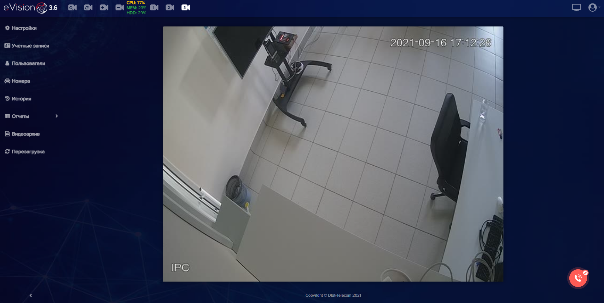

В верхней части экрана расположены:

|Элемент интерфейса|Описание|
| :- | :- |
|.png)|Кнопки **Панели устройств** позволяют управлять устройствами в **eVision**, а именно осуществлять поиск видеоустройств в локальной сети, перезапускать видеопоток с устройства, а также добавлять и удалять видеоустройства из **eVision**.|
|.png)|**Индикаторы ресурсов системы** служат для отслеживания использования процессора, оперативной памяти и жесткого диска.|
|.png)|**Кнопки подключенных устройств**, позволяют переключаться между устройствами и просматривать видеопоток, по мере добавления видеоустройств будут появляться кнопки с порядковыми номерами устройств.|
|.png)|Кнопка **Видеостена** позволяет одновременно отображать активные камеры на экране.|
|.png)|Кнопка вызова меню общих настроек **eVision**.|

В меню общих настроек находятся:

|Элемент интерфейса|Описание|
| :- | :- |
|.png)|кнопка изменения цветовой схемы, |
|.png)|кнопка для смены языка интерфейса **eVision**, |
||

кнопка вызова окна с данными о 
|
||кнопка выхода из учетной записи пользователя.|

В левой части экрана расположены кнопки и вкладки:

|Элемент интерфейса|Описание|
| :- | :- |
||на вкладке **Настройки** указываются параметры видеопотока и настройки дополнительных возможностей для данного устройства.|
||на вкладке **Учетные записи** администратором создается база учетных записей пользователей **eVision**|
||на вкладке **Пользователи** создается база сотрудников с фотографиями и настраивается доступ для подключенных устройств|
||на вкладке **История** содержится база распознанных объектов, лиц, автомобилей, и автомобильных номеров. Доступны действия по выбору источника, фильтры, экспорт данных.|
||на вкладке **Номера** создается база автомобильных номеров и настраивается доступ автомобилей для подключенных устройств|
||вкладка **Отчеты** позволяет просматривать статистику по распознанным объектам|
||на вкладке **Видеоархив** можно просматривать записи с видеоустройств,|
||кнопка для перезапуска **eVision**.|

В нижней части экрана находится:

|Элемент интерфейса|Описание|
| :- | :- |
||виджет **Открытые линии** для связи с технической поддержкой|
||кнопка для сворачивания панели вкладок.|