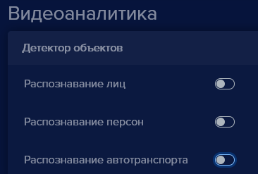

Один лицензионный ключ может работать только на одном устройстве. При необходимости лицензию можно перенести на другое устройство.

- Откройте настройки устройства, на котором нужно использовать лицензионный ключ:

- Введите лицензионный и активационный ключ, с другого устройства.

- Нажмите кнопку **Сохранить** , появится уведомление:

- Нажмите кнопку **Да**.
- Откройте **Настройки** , найдите пункт **Видеоаналитика**:
- Нажмите на переключатель **Распознавание лиц, Распознавание персон, Распознавание автотранспорта**.

- Нажмите кнопку **Сохранить** , появится уведомление:

- Нажмите кнопку **Да**..

Окно подтверждения настроек закроется. Откроется информационное окно, с наименованием устройства, на котором в данный момент используется лицензионный ключ и включена видеоаналитика.

- Нажмите кнопку **ОК**.  

Окно подтверждения настроек закроется. Перенос лицензии завершен.
