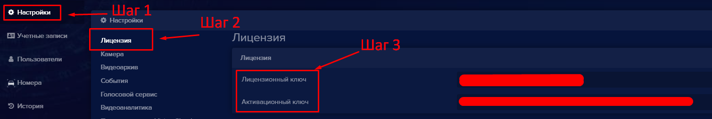
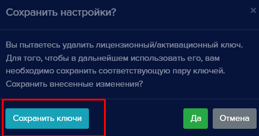
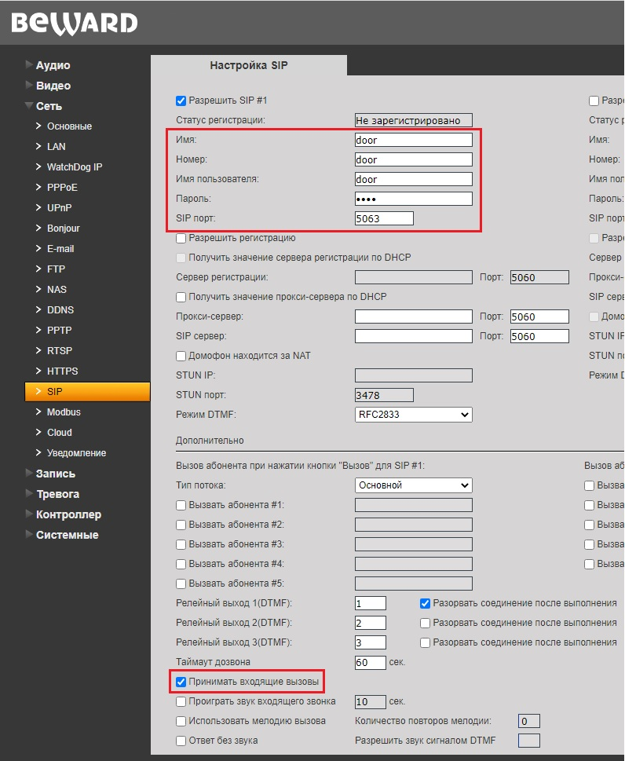
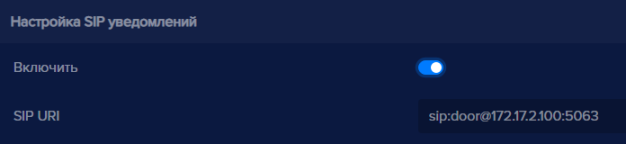
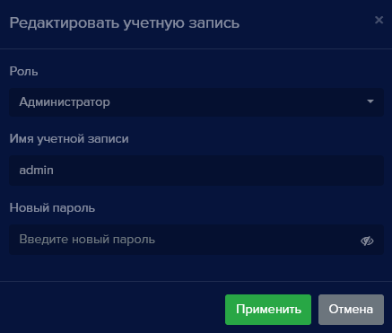
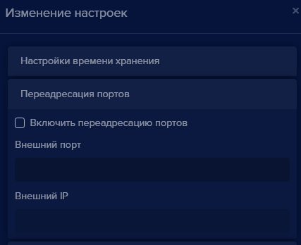
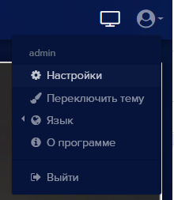
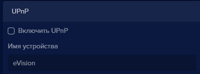

Для того чтобы сохранить **Лицензионный ключ** и **Активационный ключ** необходимо проделать следующие действия:

- В главном окне программы перейти в раздел **Настройки**
- В подменю выбрать раздел **Лицензия**
- Удалить текст из полей **Лицензионный ключ** и **Активационный ключ**
- Сохранить настройки
Появится окно **Сохранить настройки**, в котором необходимо нажать кнопку **Сохранить ключи**. Появится окно с запросом сохранения файла

После того как файл сохранен нажмите **Отмена**  для того чтобы не удалять ключи из программы.

#### Как скопировать лицензионный и активационный ключи устройства?

Для того что бы скопировать **Лицензионный ключ** и **Активационный ключ** необходимо проделать следующие действия:

- В главном окне программы перейти в раздел **Настройки**.
- В подменю выбрать раздел **Лицензия**
- Выделить текст из поля **Лицензионный ключ**, нажать правую кнопку мыши и выбрать пункт “Копировать” (либо на клавиатуре воспользоваться сочетанием клавиш **ctrl + c**). 
- Откройте место куда вы запишите скопированный ключ (приложение текстовый редактор).
- Поставьте курсор в место куда требуется вставить данные, нажмите правой кнопкой и в появившемся меню выберите пункт **Вставить** (либо на клавиатуре воспользуйтесь сочетанием клавиш **ctrl + v**). 
- Сохраните полученный результат.
Для того чтобы скопировать **Активационный ключ** проделайте шаги с третьего по шестой. 

#### Как включить голосовые оповещения
В программе eVision вы можете включить голосовые оповещения для двух типов событий: при обнаружении в  кадре движения, и в случае обнаружения детекторами объектов (как распознанных так и не распознанных).

Для включения оповещений вам необходимо проделать следующие шаги:

- Перейти в **Настройки**,
- Выбрать подменю **Голосовой сервис**,
- В программе доступны два типа оповещения по движению: **Детектор движения** - доступен сразу при установке и **Детектор объектов**  - доступен при включенном модуле **Видеоаналитика**,
- Для включения любого из видов или совместно воспользуйтесь переключателем **Включить**. О том как включить **Видеоаналитику**  можно узнать по этой [ссылке](#_n2vl2bdev4k2).

#### Как включить SIP уведомления?
Для использовани уведомления по SIP протоколу необходимо, чтобы устройство для распознавания поддерживало входящие вызовы по SIP без регистрации. Для примера будет использовано устройство Beward DS06A. Необходимо произвести предварительную настройку устройства Beward DS06A, для этого:

- Откройте в браузере интерфейс Beward DS06A. По умолчанию IP адрес Beward DS06A: *192.168.0.99*
- Перейдите в раздел **Сеть**, найдите пункт **SIP**
- Отметьте галочкой пункт **Разрешить SIP # 1**
- Пропишите в поля: **Имя, Номер, Имя пользователя** краткий идентификатор для sip вызова на устройство Beward DS06A.
- В поле **Пароль** введите пароль, он может не использоваться для работы sip уведомлений, но он необходимо для безопасности.
- В поле **SIP порт** можно прописать порт для приема SIP вызова из eVision, но этот параметр необязателен.
- Отметьте галочкой пункт **Принимать входящие вызовы**
- Нажмите кнопку **Сохранить**

Для включения SIP уведомлений в программе, вам необходимо:

Выберите устройство, нажмите на его номер на панели устройств 

Откроется видеопоток выбранного устройства

Откройте **Настройки** 
Найдите блок **Голосовой сервис**, найдите пункт **Настройка SIP уведомлений**
Переведите переключатель **Включить** в состояние включено 
Пропишите в строке **SIP URI** строку для обращения **eVision** к устройству Beward DS06A в формате: *sip:door@172.17.2.100:5063*. Где: door - номер устройства, который был введен в настройках устройства Beward DS06A, в пункте **SIP**; 172.17.2.100 - IP адрес устройства Beward DS06A; 5063 - порт для SIP вызова, необязательный параметр.

- Нажмите кнопку **Сохранить** , появится уведомление:

- Нажмите кнопку **Да**.

Окно подтверждения настроек закроется. Теперь SIP уведомления можно проверить. 

Следует помнить, что при использовании sip уведомлений, необходимо, чтобы был настроек замок. Настройка замка описана в пункте [25](#_xl0s61bc2vfd), данного руководства.

#### Как включить сервис eVision.Cloud?

Для того чтобы включить сервис **eVision Cloud** перейдите в **Настройки**,  далее в **Подключение к eVision Cloud** и затем нажмите **Активировать** 

Для того чтобы использовать **eVision Cloud**  необходимо зарегистрироваться в системе [TrustedID](https://trusted.plus/id/). После нажатия на **Зарегистрировать устройство**, откроется окно с авторизацией на портале.

#### Как поменять пароль Администратора?

**!** Для того чтобы сменить пароль администратора, необходимо находиться в системе под учетной записью роль Администратор.

Для смены пароля учетной записи администратора выполните следующие действия:

Перейдите во вкладку **Учетные записи**
Выберите учетную запись по роли в системе - **Администратор**

Нажмите редактировать и введите новый пароль учетной записи в поле **Новый пароль**

Нажмите **Применить**.

#### Какие права есть у пользователя группы Оператор?

Для учетных записей группы **Оператор** доступны следующие права:

- Просмотр видеопотока
- Просмотр видеоархива
- Просмотр персон
- Просмотр номеров
- Просмотр групп
- Просмотр истории
- Просмотр отчетов
- Работа с виджетом открытых линий

#### Как включить переадресацию портов?

Для включения переадресации портов в программе **eVision** перейдите в **Настройки** программы

Выберите пункт **Переадресация портов**, раскроется меню дополнительных настроек где можно включить переадресацию портов, и указать **Внешний порт**, **Внешний IP**

#### Как включить UPnP?

Для того что бы включить UPnP (Universal Plug and Play) перейдите в **Настройки** программы.

В окне **Изменение настроек** выберите пункт **UPnP**, откроется раскрывающееся меню где можно включить или отключить данную настройку.

#### Как работает точность распознавания?

Для того что бы настроить точность распознавания  перейдите в **Меню общих настроек** , **Настройки** , и далее выберите пункт **Настройки распознавания**.

Параметр **Минимальная точность распознавания лиц**  позволяет настроить порог при котором программа будет считать что распознанное лицо совпадает с имеющимися в базе пользователем.

#### Как работает экспорт и импорт?

В программе **eVision** доступны следующие виды экспорта/импорта:

- Настройки - общие настройки программы
- Устройства - добавленные в **eVision** устройства и их настройки.
- База данных учетных записей
- База данных пользователей
- База данных автомобильных номеров

Экспорт и импорт настроек происходит в формате **JSON** и упаковывается при экспорте в формате **ZIP**.
