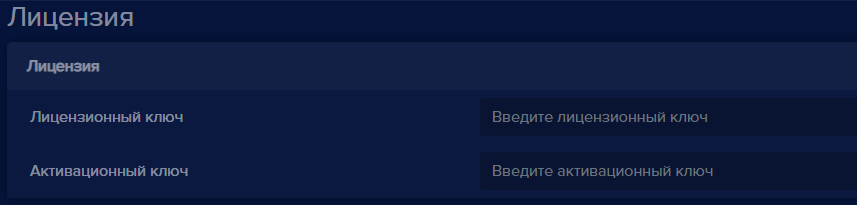
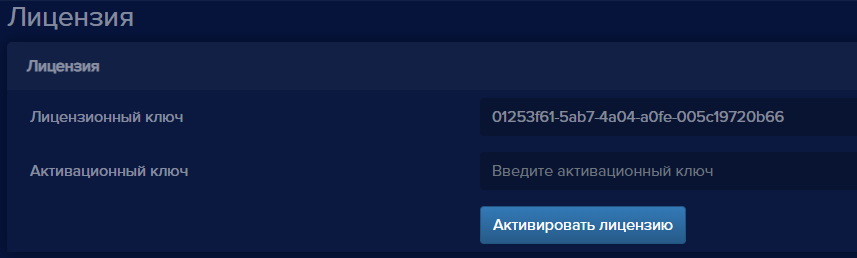
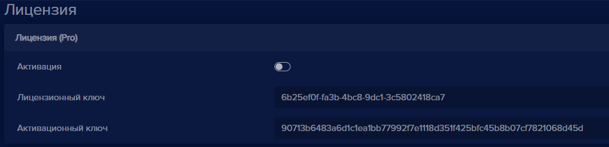
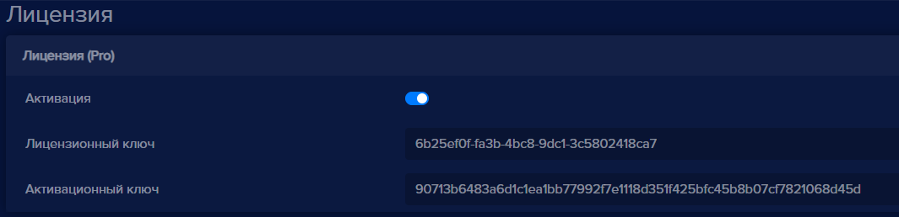
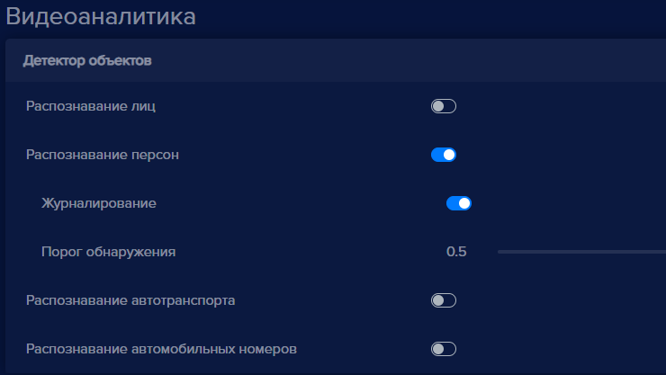

Для того, чтобы активировать лицензию:

- Добавьте устройство в **eVision**.
- Нажмите на номер устройства на панели устройств , откроется видеопоток выбранного устройства
- Откройте вкладку **Настройки** , найдите блок настроек **Лицензия**

  

- Введите лицензионный ключ в поле **Лицензионный ключ**, появится кнопка **Активировать лицензию**

  

- Нажмите кнопку **Активировать лицензию**, в настройках появится надпись с типом лицензии в заголовке блока Лицензия, переключатель **Активация**, а также в поле **Активционный ключ** появится сгенерированный на сервере активационный ключ для данного лицензионного ключа, лицензия успешно активирована.

  

- Нажмите на переключатель **Активация** и нажмите кнопку **Сохранить** , появится уведомление:

- Нажмите кнопку **Да**, после завершения сохранения настроек перключатель Активация будет в активном состоянии, затем можно выбирать тип объектов для распознавания,

  

- Откройте **Настройки** , найдите пункт **Видеоаналитика**:

- Нажмите на один или несколько переключателей **Распознавание лиц, Распознавание персон, Распознавание автотранспорта**, **Распознавание автомобильных номеров**.

  

появяться настройки выбранного детектора объектов,

- Нажмите кнопку **Сохранить** , появится уведомление:

- Нажмите кнопку **Да**.

Окно подтверждения настроек закроется.

- Проверьте распознавание объектов.

**Важно** Сохраните лицензионный и активационный ключи, в случае их удаления или удаления устройства, восстановить пару ключей невозможно. Активационный и лицензионный ключи можно использовать на данном компьютере для одного устройства.

