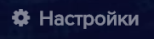

В случае, если на компьютере, где установлен **eVision** отсутствует доступ в интернет, существует возможность активации лицензионного ключа в режиме оффлайн. Чтобы активировать лицензионный ключ без доступа в интернет:

- Добавьте устройство в **eVision**.
- Выберите устройство, нажмите на его номер на панели устройств , откроется видеопоток выбранного устройства
- Откройте вкладку **Настройки** , найдите блок настроек **Лицензия**
- Введите лицензионный ключ в поле **Лицензионный ключ**.

- Введите лицензионный ключ в поле **Лицензионный ключ**, появится кнопка **Активировать лицензию**

  

- Нажмите кнопку **Активировать лицензию**, появится окно **Информация**

  

Будет указан адрес сайта для активации лицензионного ключа. А также код активации, который нужно скопировать. 

**Важно:** Не закрывайте окно **Информация**

- Перейдите по ссылке на компьютере с доступом в интернет: <https://api.evision.tech/activation/>, откроется страница **Активация Лицензионного ключа**

  

- В поле **Запрос на активацию** вставьте текст из окна **Информация**:

  

- Нажмите кнопку **Отправить**

В поле **Активационный ключ** появится активационный ключ:

- Скопируйте активационный ключ, перенесите его в **eVision**, и в окне **Информация** введите ключ в поле: **Введите активационный ключ**:

- Нажмите кнопку **Применить** , окно 
- **Информация** закроется.

В настройках устройства, в блоке **Лицензия**, в поле Активационный ключ будет отображен введенный ранее активационный ключ, лицензия будет активирована.

  